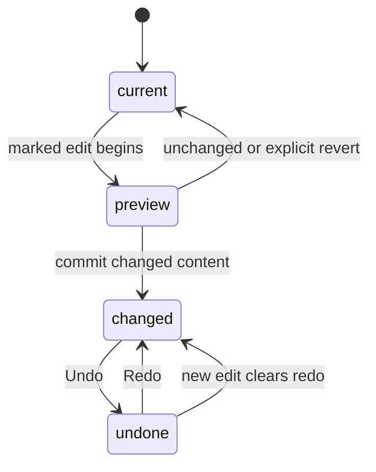

# Undo, redo, and unsaved changes

## Summary

Undo restores document changes; Redo reapplies them. A completed gesture is
normally one action. Dirty state means current saved document content differs
from the last saved snapshot, not simply that the user pressed a key.

## The simple case

Create an object and Undo once to remove it. Redo brings it back. Move it through
several preview positions and release; Undo once restores its starting position.
Pan around the workspace and Undo still targets the preceding document edit.

## The interaction, event by event

### Press

An edit can open a history mark holding its prior state. Cmd/Ctrl+Z requests Undo;
Cmd/Ctrl+Shift+Z or Cmd/Ctrl+Y requests Redo when editor shortcuts own focus.
An empty undo or redo stack performs no action.

### Release without dragging

An unchanged document comparison produces no history change. Selection, hover,
pan, zoom, open dialogs, and theme changes are not document history actions.
No-movement prepared object drags revert their mark.

### Begin dragging

A marked gesture groups updates so pointer ticks do not become separate Undo
steps. Different controls still have different boundaries: ordinary numeric text
edits can apply on each change, while scrubs explicitly group their updates.

### While dragging

Some artwork is previewed separately from committed nodes. Other edit paths may
change data inside an active mark. The user-visible history contract therefore
depends on finishing or reverting the correct session.

### Release

Committing changed content pushes an undo change and clears redo. Undo/Redo
restores the appropriate added, removed, updated, and reordered objects. History
application returns the tool to Pointer and clears editing/group-focus state.
It retains currently selected ids only when those objects still exist; it does
not restore a historical selection. The
default history limit is 100 changes. Saving establishes the current snapshot
as the dirty-state baseline; undoing to matching saved content can clear dirty.

## Modifiers

| Modifier | Set at the start | Changed while dragging |
| --- | --- | --- |
| Shift | With Cmd/Ctrl+Z selects Redo. | No special gesture rollback by itself. |
| Alt/Option | Excludes the normal Z/Y history shortcut. | Duplicate-drag content remains one marked action. |
| Ctrl/Cmd | With Z/Y requests history navigation. | Can invalidate an active gesture mark; browser continuation requires verification. |
| Space | Enables pan outside inputs without a history edit. | Does not cancel a document mark automatically. |

## Cancel and interrupt

| Event | Before dragging | While dragging |
| --- | --- | --- |
| Escape | Tool/context action, not universal Undo. | Only restores content if the owning gesture invokes a revert path. |
| Switching tools | Can finalize inline text. | Tool-specific finishing applies; marks are not universally canceled. |
| Menu opening or undo/redo | Empty stack is a no-op. | Undo/Redo clears active marks; stale session handling needs verification. |
| Window loses focus | Clears modifiers, not undo stack. | No global history revert just for blur. |
| Pointer leaves the window | Does not consume history. | Gesture ending depends on browser event delivery. |
| Reload or tab close | In-memory history does not itself persist. | Saved/scratchpad content restoration is separate from history restoration. |
| Target changed or deleted | Deletion itself may be undoable. | Overlapping changes and active marks need session-specific checking. |
| Touch cancel or second input device | No independent history behavior. | Selection transforms commit pointercancel; other tools may revert. |

## Interactions with other systems

Containers and groups undo as document changes including descendants. Hidden
flags restore as document content. Selection keeps surviving current ids rather
than a historical selection, and plain selection does not independently add
history. History is the subject of this
page. Zoom stays outside it. Offline editing retains local undo state while the
page is alive. Touch and stylus affect gesture delivery. Collaboration history
merging is not established.

## Edge cases

- An edit after Undo discards the redo branch.
- “Cancel” and `pointercancel` are not interchangeable rollback promises.
- Dirty compares snapshots, so it can clear without an additional Save if the
  design returns exactly to the saved state.
- Undo that restores a deleted object need not select it. Undo while using Eraser
  can restore pixels and return to Pointer, as observed in the browser pass.

## Open questions and verification

- Verify undo during active transforms and numeric-entry granularity.
- Evidence: HistoryManager, document-change, marked selection gestures, history
  tests. Default limit and snapshot rules are source-reviewed, not browser-measured.

Source reviewed against PunchPress commit `d4e6d4a`. Status: drafted.
