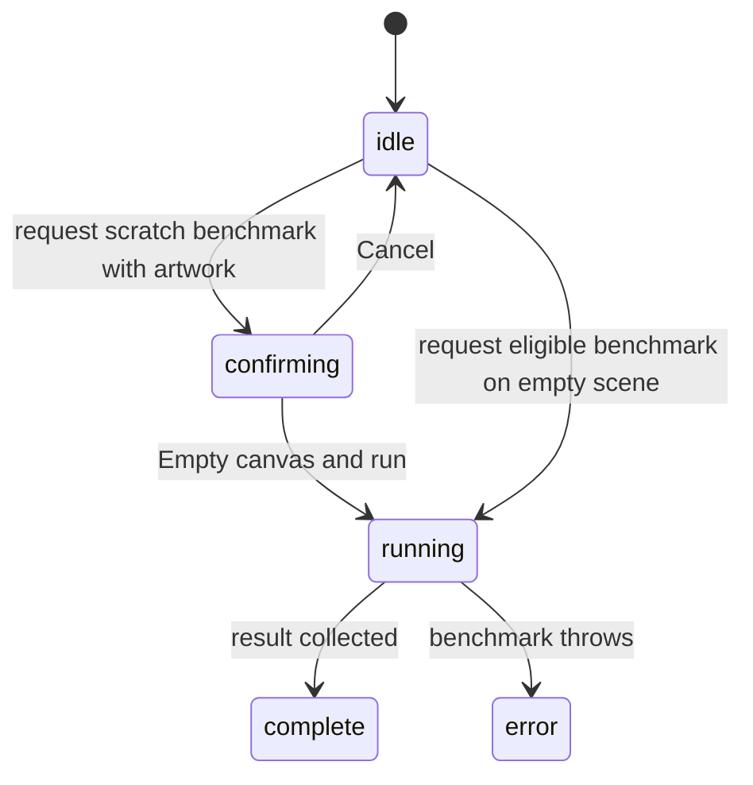

# Performance feedback and benchmarks

## Summary

The optional performance HUD exposes frame timing and diagnostics. Benchmarks
exercise named repeatable scenes and report results. Running a scratch-scene
benchmark can clear the current artwork; this is an explicitly warned operation.

## The simple case

Press Cmd/Ctrl+Shift+P with editor focus to toggle the HUD. Inspect frame timing
while interacting. To run a benchmark, use disposable content; if existing
artwork would be cleared, the UI asks before proceeding.

## The interaction, event by event

### Press

The HUD shortcut respects ordinary focus exclusions and rejects Alt. Requesting
a benchmark does nothing if one is already running or no definition is selected.

### Release without dragging

Opening the HUD does not start a benchmark. Canceling the confirmation leaves
the requested benchmark unstarted. The confirmation warns that unsaved canvas
work will be lost and is not dismissed by an outside pointer click.

### Begin dragging

Here the extended phase is a running benchmark rather than a pointer drag.
After confirmation, setup prepares its scene, warmup frames run, and measurement
begins. The visible status becomes running with an elapsed-time message.

### While dragging

The controller prevents a second simultaneous run. It collects timed work and
frame results. Hiding the HUD is not specified as canceling the benchmark.
Do not read every slow frame as proof that a particular editor action is slow;
unattributed time and environment conditions remain separate evidence.

### Release

Success stores a result and complete status; exceptions produce an error result
and message. Scratch-document benchmarks clear the scene in final cleanup even
after failure. They do not restore the user's former document from a backup.

## Modifiers

| Modifier | Set at the start | Changed while dragging |
| --- | --- | --- |
| Shift | Required with Cmd/Ctrl+P for the HUD shortcut. | No benchmark measurement mode. |
| Alt/Option | Blocks the HUD shortcut. | No benchmark cancellation mode. |
| Ctrl/Cmd | Combined with Shift+P toggles HUD. | Toggling display does not establish a stop request. |
| Space | Normal editor/input routing. | Interaction can affect measurements; no benchmark cancel meaning. |

## Cancel and interrupt

| Event | Before dragging | While dragging |
| --- | --- | --- |
| Escape | Dialog dismissal may cancel pending confirmation. | No benchmark-wide Escape cancellation is established. |
| Switching tools | Normal editor action before a run. | Can contaminate a measurement; no automatic rollback promise. |
| Menu opening or undo/redo | Confirmation precedes destructive scratch setup. | History/menu input during a run needs verification and should not be treated as a valid benchmark condition. |
| Window loses focus | May affect measurement eligibility. | Background scheduling affects timing; report environment rather than treating result as equivalent. |
| Pointer leaves the window | No benchmark start from hover. | Depends on scenario's scripted interaction, not pointer release alone. |
| Reload or tab close | Local pending state ends. | Interrupts the run; no resumable benchmark established. |
| Target changed or deleted | Scratch-scene setup defines targets. | Scenario may fail and report error; cleanup can still clear scene. |
| Touch cancel or second input device | No special benchmark contract. | Physical input can alter the scene or timing; not a controlled result. |

## Interactions with other systems

Containers and groups appear in benchmark-specific scenes. Selection and hidden
objects affect measured work; preserve scenario conditions. History does not
guarantee recovery of pre-benchmark artwork. Zoom is scenario-dependent. Offline
operation depends on fixture availability. Touch and stylus are not automatically
represented by scripted mouse benchmarks. Collaboration is not benchmarked here.

## Edge cases

- A scenario opting out of scratch-document use avoids this clearing workflow.
- Failed scratch runs also clear their scene in final cleanup.
- Diagnostics measure work; they do not promise a universal frame-rate target.
- The Settings UI currently has Appearance and Debug, not the performance panel
  described in some older docs. The dedicated HUD shortcut is the verified route
  to inspect next.

## Open questions and verification

- Verify HUD opening/closing and confirmation cancellation in a disposable tab.
  Do not run destructive benchmarks on a user's active design.
- Evidence: performance provider/controller and benchmark runner confirmation.
  No benchmark timing claims were measured in this documentation task.

Source reviewed against PunchPress commit `d4e6d4a`. Status: drafted.
