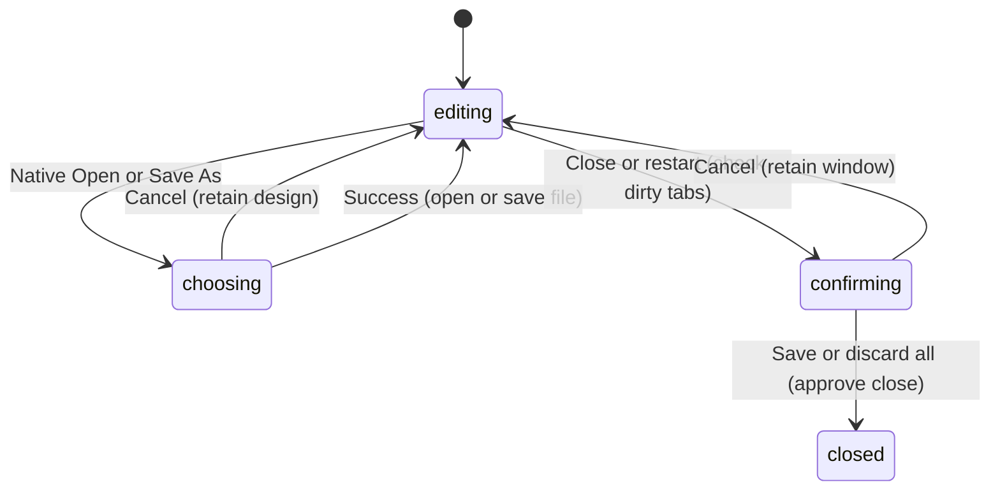

# The desktop app

## Summary

PunchPress desktop presents the same editor with native file dialogs, macOS
menus, `.punch` open-file handling, local font access, and automatic updates.
Its document semantics are shared with the web editor; its window lifecycle and
file identities add platform-specific behavior.

This document describes the packaged desktop application from source. Running
the development shell is not sufficient to verify packaged quit protection or
the update experience.

## The simple case

Choose File → Open and select a `.punch` file. A file tab opens. Save writes to
its existing path; Save As offers a native chooser initially based on the
current file's directory. Choosing a new path updates the same tab.

Open the same path again. Desktop file identity focuses the existing tab rather
than loading a second editor. The in-memory design stays intact, including any
unsaved edits. This is different from the current browser-handle tab behavior.

Close a packaged window containing a dirty file tab. The editor asks whether
to save, discard, or cancel before allowing the close. Scratchpad does not join
those prompts because it has its own local autosave path.

## The interaction, event by event

The five phases map to invoking a native command, declining it, beginning file
or close work, waiting for platform/renderer work, and completing the command.

### Press: native entry points

The File menu exposes New, Open, Import SVG, Save, Save As, and Export. The
accelerators are Cmd/Ctrl+N, O, S, Shift+S, and E. Native menus forward these
commands to the editor rather than reading or changing its nodes themselves.

Opening `.punch` files from the operating system queues them until the main
window and renderer are ready. Unsupported extensions are not accepted by that
document-opening path. SVG belongs to Import SVG instead.

### Release without dragging: cancel or existing tab

Canceling a native file chooser returns without an opened file or completed
write. Opening an already-open normalized path focuses its tab. It does not
refresh that editor from disk, so external file changes are not silently merged.

A close confirmation dismissed without a Save/Discard choice means Cancel.
Repeated close requests while a decision is pending do not create stacked
confirmation dialogs.

### Begin dragging: pending close and file work

Ordinary Save can write directly to the known filesystem path. First Save uses
the Documents directory as its default context; Save As uses the prior file's
directory when available. SVG and PNG outputs always use their own chooser.

Packaged window close asks the renderer for approval. Quit and restart-to-install
also use the approval route when the renderer is ready. The renderer visits
dirty file tabs sequentially, so one canceled save prevents the overall quit.

### While dragging: updates and outstanding commands

Packaged builds initialize automatic update checks after a default three-second
delay and repeat checks every ten minutes. Downloads happen automatically.
The updater tracks download percentages, but the current titlebar indicator is
hidden until the update is ready. It does not display download progress.
Checking and failures return through updater status rather than blocking
ordinary artwork editing.

Once an update is downloaded, a native dialog offers Restart or Later. Later
leaves editing available. Restart requests the same dirty-document approval
before installation. Actual downloaded-update behavior needs a controlled
packaged-build test with an available update.

The ready titlebar button initially says Update. Its first click shows a short
disabled preparation state; after 720 ms it says Restart To Apply Update. A
second click requests restart. The first click is not another network download:
the updater has already reported that the update is ready.

### Release: complete the platform action

File success produces the shared Saved/Exported feedback. Desktop recent files
retain up to ten available paths, newest first, and synchronize with system
recent documents. The native recent menu disambiguates repeated basenames with
directory sublabels. Clear Recent removes list entries, not files.

Approved window close destroys the window. Approved quit or update installation
continues the corresponding application action. A renderer response from the
wrong request or window is ignored. If a renderer is not ready, the controller
cannot obtain the normal interactive approval; that startup/failure case is not
equivalent to a tested dirty-editor quit.

## Modifiers

| Modifier | Set at the start | Changed while dragging |
| --- | --- | --- |
| Shift | Cmd/Ctrl+Shift+S invokes Save As. | Native picker selection and text editing apply; no alternate save format. |
| Alt/Option | Native accelerator matching belongs to Electron/OS, not browser matching. | Native menu and dialog behavior requires platform verification. |
| Ctrl/Cmd | Native accelerators invoke document commands. | Repeated shortcuts during pending dialogs need verification. |
| Space | Native focused controls determine activation or text entry. | Renderer temporary-pan behavior is separate from native dialogs. |

The renderer's browser document-shortcut listener is disabled when the desktop
document bridge exists, avoiding intentional duplicate routing through both.

## Cancel and interrupt

| Event | Before dragging | While dragging |
| --- | --- | --- |
| Escape | Native picker/dialog cancellation depends on focused control. | Canceling dirty confirmation keeps the window; cancellation after disk submission needs checking. |
| Switching tools | Shared engine tool behavior. | Native operations are not canceled by tool changes; modal command blocking needs verification. |
| Menu opening or undo/redo | Native menus expose shared editing commands. | Focus and pending-save snapshot races need native testing. |
| Window loses focus | Native chooser can take focus normally. | No general blur cancellation of file or update work. |
| Pointer leaves the window | No native command is submitted merely by leaving. | Button tracking/OS drag behavior needs device verification. |
| Reload or tab close | App file tabs follow shared close rules; window close follows packaged approval. | Development window close bypasses the packaged window handler; renderer crashes/force quit are not protected recovery flows. |
| Target changed or deleted | Unavailable recent paths are filtered. | Concurrent disk changes have no inspected conflict-resolution dialog. |
| Touch cancel or second input device | Native platform controls need device verification. | No separate desktop touch rollback semantics are established. |

Canceling quit leaves the application open; files saved earlier in the same
multi-tab sequence remain written. The cancellation does not undo those saves.

## Interactions with other systems

**Containers and groups.** Desktop uses the same document nodes, not a second
container or composition model.

**Selection and locked/hidden objects.** Native commands read the active editor
state. Native export therefore shares Frame-selection behavior.

**History.** Native Undo/Redo routes to engine history. Window lifecycle and
update downloads are not document undo steps.

**Zoom.** The shared canvas controls viewport scale. Native save/export does not
use window size as a production-resolution setting.

**Offline.** Packaged app files and local design files are available locally.
Asset search and update discovery still require their services; the existence
of a desktop shell does not make those online features offline-capable.

**Touch and stylus.** No desktop-specific drawing contract is inferred from
Electron input support. Hardware tests belong to the tool descriptions.

**Collaboration.** This is one local main editor window with multiple tabs.
No synchronized multi-window or remote-editing workflow is established.

## Edge cases

- File → Export SVG is labeled as SVG even though selecting a Frame produces
  PNG. This mismatch is observable from the shared command branch.
- External allowed links open in the system browser rather than a new editor
  window. Exact supported-link behavior needs the packaged-shell pass.
- Native open-file failures can be logged by the shell before content reaches
  the renderer; do not promise every launch-time failure gets a toast.
- Existing desktop product docs promise a percentage while downloading. The
  current indicator renders only ready state, a source-supported contract gap.

## Open questions and verification

Verify packaged close, quit, restart with several dirty tabs, native permissions,
file association, missing recent paths, and an actual downloaded update. Native
font details are owned by the separate fonts description.

Evidence: desktop document files/opening/recent files, main window controller,
application menu, updater, and shared document commands. See
[the checklist](../verification/documents.md#desktop).

Source reviewed against PunchPress commit `d4e6d4a`. Status: drafted.
