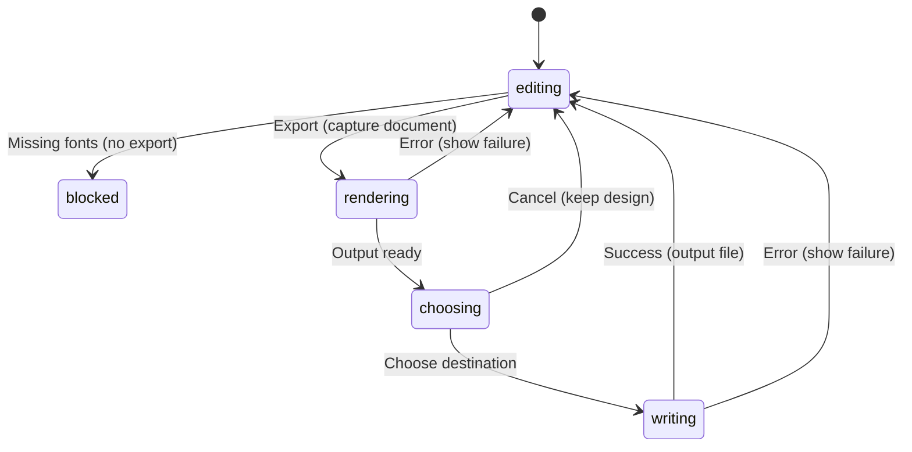

# Export artwork

## Summary

Export writes production artwork from the active design. With a Frame as the
singular selected node it produces PNG at that Frame's dimensions. Otherwise it
produces a document SVG. A selected ordinary object does not limit SVG export
to that object. Cmd/Ctrl+E invokes Export outside blocked browser focus targets.

Export is separate from saving the editable `.punch` source. A successful export
does not change the file tab's destination or mark its artwork saved.

## The simple case

Select one Frame, choose Export, and select a PNG destination. The PNG uses the
Frame's name and dimensions, includes its visible descendants, and uses its
background. Artwork outside the Frame's ownership is not included merely
because it overlaps the production region on screen.

Deselect the Frame and export again. This time the chooser offers SVG, using
the active tab's basename. The document stays open for editing after success.

## The interaction, event by event

For Export, press is invocation, the short path is rejection or cancellation,
and the extended phase covers font loading, SVG building, PNG rendering, and
file writing. These are command phases, not a canvas drag-distance threshold.

### Press: choose the production boundary

The command inspects the selected node before beginning. A singular Frame
selects the PNG route; other selections select document SVG. The PNG filename
comes from the Frame name, while document SVG uses the tab basename.

Export checks missing fonts across the document before producing either format.
Missing fonts anywhere can block even a selected Frame whose visible content
does not use them. This is the implemented scope, not a claim that only the
selected production region is validated.

### Release without dragging: blocked or canceled

Fonts absent from the catalog open a dedicated export dialog. A catalog-present
font whose bytes fail to load instead follows the general export-error path.
General rendering or file errors
show an error toast. Canceling the output chooser keeps the editor open and
does not show the export success toast.

Empty-document export still uses the SVG builder's default dimensions. It is
not an error merely because no object is selected or no Frame exists.

### Begin dragging: capture exportable artwork

Getting the document finalizes an active inline Text edit before building output.
The export renderer reads serializable artwork rather than selection handles,
hover indicators, guides, or the current viewport chrome.

Hidden nodes and descendants of hidden ancestors are excluded from rendered
artwork. Group containers are not exported as independent painted objects, but
their descendants retain inherited opacity. A Vector is exported as composed
geometry rather than painting its child Paths again independently.

### While dragging: build SVG or PNG

Document SVG renders supported nodes within the SVG builder's default page
dimensions: 4500 × 5400 at this baseline. It is not automatically bounded to the
selection or fitted to all workspace artwork. Production Frame export instead
sets the selected Frame's width, height, origin offset, and background.

Document SVG defaults to a dark background (`#2d2d2d`). It does not export the
canvas dot grid or use the active UI theme as its background setting.

Raster artwork is written as image content, including tile images where used;
this build has no user crop/mask representation to preserve. Text/vector
geometry is baked into production paths. Actual
appearance still needs output inspection for representative node combinations.

PNG first renders the Frame SVG through a browser image, then draws it into a
canvas. Pixel dimensions are rounded to integers and clamped to at least one.
There is no DPI or resolution-multiplier chooser in this command path.

### Release: write and report

Success shows an Exported toast naming the output. SVG and PNG export do not
join recent `.punch` documents. The current selection and editing tab remain.

Document SVG embeds a PunchPress document recipe in metadata. The rendered SVG
can omit hidden artwork while that recipe retains the full editable document.
Consequently the file is not a sanitized visible-only representation of all
source data. The PNG route rasterizes the SVG and writes image pixels; it does
not copy that embedded recipe into the PNG through this pipeline.

## Modifiers

| Modifier | Set at the start | Changed while dragging |
| --- | --- | --- |
| Shift | Cmd/Ctrl+Shift+E still maps to Export in browser code; no alternate format. | Native chooser selection behavior; no export scaling modifier. |
| Alt/Option | Prevents browser document shortcut matching. | No alternate background or transparency option. |
| Ctrl/Cmd | E invokes Export. | Repeated export invocation while pending needs verification. |
| Space | Focus rules from input foundations apply. | No export cancellation or quality switch; popup Space needs checking. |

Selection at invocation, not a held modifier, decides PNG versus SVG.

## Cancel and interrupt

| Event | Before dragging | While dragging |
| --- | --- | --- |
| Escape | Can dismiss an output chooser or missing-font dialog. | No renderer abort operation is exposed; verify picker delivery. |
| Switching tools | Can finalize editing before Export is invoked. | Does not retarget captured export; live editing during rendering needs checking. |
| Menu opening or undo/redo | Export follows the document state at invocation. | Undo is not an export undo; output snapshot timing needs verification. |
| Window loses focus | File chooser focus is expected. | Blur does not explicitly cancel font/image rendering. |
| Pointer leaves the window | No output is created without invocation. | Pointer location does not change export crop after selection is captured. |
| Reload or tab close | Dirty file prompts concern source saves. | Pending render/write has no persisted export job or resume path. |
| Target changed or deleted | Selection determines current production boundary. | Deleting the Frame after invocation needs a race check; no live boundary tracking is promised. |
| Touch cancel or second input device | Device chooser support needs verification. | Rendering is not driven by continued pointer movement. |

Canceling output does not revert Text finalization that happened while capturing
the document. Source edits and file production are separate outcomes.

## Interactions with other systems

**Containers and groups.** PNG membership follows Frame descendants. Group and
Vector structure affects rendered opacity and composition; overlap alone does
not establish Frame ownership.

**Selection and locked/hidden objects.** Locks do not exclude visible artwork.
Visibility filters rendering, but embedded SVG metadata retains the source.

**History.** Export adds no production-file undo step. Finalizing Text can
complete its existing edit; saving source remains a separate action.

**Zoom.** Viewport zoom does not select output resolution. Frame dimensions
determine PNG pixels; the document SVG has its own page dimensions.

**Offline.** Export needs available font/image data and a working file platform.
External asset search is not required to render already available content.

**Touch and stylus.** Export controls need device checks, but output resolution
does not depend on pointer pressure or touch count.

**Collaboration.** Export is a snapshot, not a synchronized shared design. SVG
metadata can restore editable source via Import SVG.

## Edge cases

- Native File menu currently says Export SVG even when a selected Frame causes
  PNG export. General export error titles also say SVG for PNG failures.
- Missing-font checks include hidden/off-boundary text; verify this with a
  document whose visible Frame uses only available fonts.
- Very large PNG dimensions may exceed browser canvas limits; no maximum-size
  guard or tiled PNG output is exposed here.

## Open questions and verification

Verify output files in an independent viewer: dimensions, background, alpha,
Frame membership, hidden ancestors, group opacity, raster tiles/alpha, and SVG
recipe restoration. Engine export tests are source evidence, not a visual pass.

Evidence: document export actions, `document/export.ts`, `node-svg-export.ts`,
document command PNG rendering, and vector/SVG recipe tests. See
[the checklist](../verification/documents.md#export).

Source reviewed against PunchPress commit `d4e6d4a`. Status: drafted.
