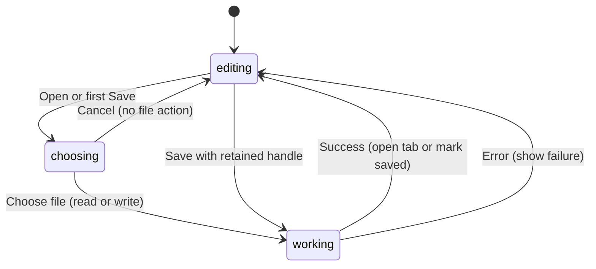

# Open, save, and recent files

## Summary

Open reads an editable `.punch` design into a file tab. Save writes the active
file tab, and Save As chooses a new destination and updates that tab's identity.
Recent documents offer previously opened or saved files when the platform can
retain access. Scratchpad is excluded from these file identities.

Browser shortcuts are Cmd/Ctrl+O, Cmd/Ctrl+S, and Cmd/Ctrl+Shift+S outside inputs,
menus, and dialogs. The browser's chooser and permission controls remain part of
the experience, so saving is not identical across browsers.

## The simple case

Create a file tab, add artwork, and invoke Save. Choose a `.punch` filename.
After the write succeeds, a Saved toast appears and the tab uses the chosen
basename. A retained handle allows later Save to target that file again.

Choose Open and select the saved file. Its design opens in a file tab; it does
not replace Scratchpad or another design. Canceling Open leaves the workspace
as it was. Invalid document data produces an error toast.

## The interaction, event by event

Here press means command invocation, the short path is chooser cancellation,
and the extended phase is reading or writing the selected file.

### Press: invoke the file command

Open filters for `.punch` documents. Save serializes the chosen tab and uses its
basename and current handle. Save As deliberately drops the write target so a
chooser opens; on desktop it retains the existing directory as dialog context.

Invoking either save command on Scratchpad shows “Scratchpad saves
automatically.” It does not convert Scratchpad into a file tab or export a
`.punch` copy. Copying content to a new file tab is a separate workflow.

### Release without dragging: cancel or unavailable recent access

Canceling Open returns without creating a tab. Canceling Save returns without
marking the design saved. If Save was part of a close decision, the tab stays
open. Browser abort exceptions are treated as cancellation, not error toasts.

Opening a recent browser file can require read permission. Denying that request
returns without opening content. A record whose permission is already denied
is removed from the visible recent list during normalization.

### Begin dragging: read or write

Open accepts packaged `.punch` bytes and legacy text documents through the
schema loader. The package contains editable document data and raster assets.
Parsing and font resolution complete before the new editor is added to tabs.

Save writes a package. File identity updates and marking the editor saved happen
after the platform reports success. File writing and recent-list storage are
sequential steps, so a recent-storage error may occur after file bytes were
already written; a generic failure does not prove no file exists.

### While dragging: pending platform work

There is no application-level save progress meter or cancellation token in this
command path. The platform owns the picker and actual file write. A browser
without retained file handles can use a download-style fallback.

Recent browser files are kept only when IndexedDB and FileSystemFileHandle are
available. Up to ten are retained, newest first. File identity comparisons
deduplicate the list even though [tab deduplication](workspace-tabs.md#edge-cases)
currently differs between browser and desktop.

### Release: finish and report

Successful save updates the tab basename and handle, marks the current editor
saved, shows a Saved toast, and refreshes recents. Save As keeps the same tab
and changes its destination rather than opening a second tab.

Successful Open resets the newly created editor's history and schedules its
content into view. Missing-font replacement may show a warning when a replacement
font exists. In a browser whose local-font catalog has not been enabled, the
catalog can be empty rather than proving those fonts are absent. Opening still
replaces absent-catalog descriptors with the default, then establishes the loaded
document's saved baseline. This can change typography before permission is
granted; see [B-17](../bug-triage.md#b-17). Parse/read/write errors show
command-specific error toasts.

Clear Recent empties the list; it does not delete the design files or close
their tabs. Exported SVG and PNG files do not enter this `.punch` recent list.

## Modifiers

| Modifier | Set at the start | Changed while dragging |
| --- | --- | --- |
| Shift | Cmd/Ctrl+Shift+S selects Save As. | Picker selection/text behavior belongs to the browser or OS. |
| Alt/Option | Prevents browser document-shortcut matching. | No alternate package format is defined. Native chooser behavior needs checking. |
| Ctrl/Cmd | O opens; S saves. | Repeated invocation during writes has no explicit command queue; verify races. |
| Space | Text fields keep spaces. | Does not cancel a pending read/write; popup focus behavior needs checking. |

The command choice is fixed when invoked; modifier changes do not turn Save
into Save As halfway through a write.

## Cancel and interrupt

| Event | Before dragging | While dragging |
| --- | --- | --- |
| Escape | Picker cancellation ends Open/Save without success. | No post-submission cancellation hook; verify OS behavior. |
| Switching tools | Changes editor tool before serialization. | No tool-driven write cancellation; pending edit/save races need checking. |
| Menu opening or undo/redo | Commands act on the active editor. | No captured-history revision is restored on save completion; edit/undo during writes needs checking. |
| Window loses focus | Native chooser focus is expected. | No blur-driven file cancellation; denied permissions or write errors can still fail. |
| Pointer leaves the window | Does not choose a file. | Platform controls own held-pointer completion. |
| Reload or tab close | Dirty file tabs request browser unload protection. | Browser shutdown can interrupt work; no guaranteed pending-write recovery. |
| Target changed or deleted | Missing recent files can fail on read. | External file replacement/write conflicts have no inspected merge UI. |
| Touch cancel or second input device | Picker interaction is platform-specific. | Device takeover during a chooser needs verification. |

Errors keep the editing session available when the page remains alive. A failed
file operation is not an undo operation on the artwork.

## Interactions with other systems

**Containers and groups.** `.punch` preserves document structure rather than
flattening groups into production artwork.

**Selection and locked/hidden objects.** Saving includes document nodes,
including hidden or locked content. Open is not limited by current selection.

**History.** Save records the saved baseline; it does not add artwork. Loading a
new editor resets its undo history. Switching existing tabs retains their history.

**Zoom.** File serialization saves nodes; loading fits content. A file round trip
does not promise exact restoration of the previous pan or zoom.

**Offline.** Local file bytes can be read and written without an external asset
request. App availability, font access, and browser permissions are separate.

**Touch and stylus.** File controls are platform UI; no pen-specific save behavior
is defined, and physical-device verification remains outstanding.

**Collaboration.** There is no file merge or other-user notification in these
flows. External edits need explicit reopen and inspection.

## Edge cases

- A successful fallback download may return no persistent handle. The workspace
  then still considers the tab unsaved because it has no handle.
- A file remembered before validation can appear in recents even if loading its
  document fails. Recent presence is not a guarantee of valid content.
- Suspected race: changing artwork during a pending Save can mark newer state
  saved even though serialization captured the earlier content. Verify with a
  slow destination before assigning a user-visible reproduction.
- Two files with the same basename are separate identities.

## Open questions and verification

Check handle-capable and fallback browsers, revoked permissions, missing files,
quota failure, save errors, and edits during pending writes. Do not use a mocked
platform test as proof of an operating-system chooser's behavior.

Evidence: `web-document-files.ts`, `browser-recent-documents.ts`, document
command hooks, and their platform tests. See
[the checklist](../verification/documents.md#files).

Source reviewed against PunchPress commit `d4e6d4a`. Status: drafted.
