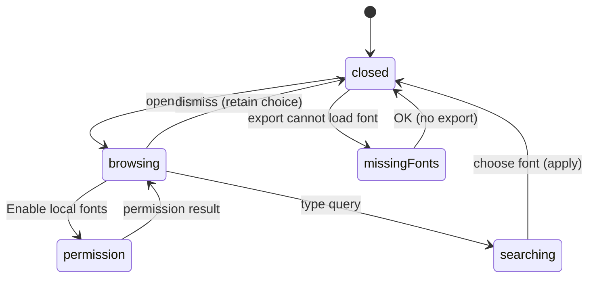

# Local fonts, previews, and missing fonts

## Summary

Text stores the identity of a local font and loads its bytes when rendering,
previewing, or exporting needs them. The Font picker in text Properties discovers
installed fonts through the host platform. Availability and permission are
separate from the editable wording stored in the document.

## The simple case

Select a text object, open Font, and enable local fonts if the browser requests
access. Search the installed catalog and choose a font. The picker closes and the
selected text adopts that descriptor. The choice also becomes the remembered
font for subsequent text creation when it remains available.

If a document references a font absent from the current catalog, export
shows “Can't export while fonts are missing.” Install that font or choose a
replacement before retrying; the dialog offers OK, not an export-anyway action.

## The interaction, event by event

### Press

Opening the picker focuses Search fonts. A supported browser initially offers
“Enable local fonts” rather than automatically listing every installed face.
An unsupported browser displays the unsupported state. Desktop supplies its
catalog through its native font bridge; native behavior needs its own pass.

Requesting access can produce ready, permission-denied, unsupported, or error
feedback. Catalog entries are deduplicated by identity and sorted by full name.
The selected font label can still appear when that font is absent from the list.

### Release without dragging

Opening then dismissing the picker without choosing an option keeps the text's
font. The search query clears when the popup closes. Escape from Search fonts
closes the popup instead of becoming a canvas tool shortcut.

The Enable local fonts action requests the catalog. A granted permission does not
itself replace the selected text's font.

### Begin dragging

The extended phase is searching, scrolling options, or waiting for local access.
Search matches normalized font search text. Font names can appear before their
preview bytes finish loading; a visible name alone is not evidence that the face
has successfully loaded for rendering.

### While dragging

Ready previews use the actual loaded font family. Until ready, picker text uses
its normal fallback styling. Loading, access-required, denied, unsupported, and
error states have distinct messages rather than being presented as an empty
installed-font catalog.

Default-font resolution first tries the remembered face, then preferred installed
sans families, then the first available face or built-in descriptor. New text
uses that default. Loading a document also replaces every font descriptor absent
from the current catalog with this default, preserving wording but changing
typography. The file-opening path displays a replacement warning and marks the
loaded state saved.

A browser catalog starts empty until local access is requested. Opening a file
in that state therefore replaces even installed faces whose availability has
not yet been queried. Enabling access afterward loads the catalog but does not
restore the original descriptors. This is a supported typography-fidelity risk.

### Release

Choosing an option writes the font descriptor to selected text and closes the
picker. Wording remains live. Layout can update when font bytes become ready.
The descriptor records family, full name, PostScript name, and style; it does not
embed a portable installed font file into every text object.

Export first checks each text descriptor against the available catalog. Faces
absent from that catalog appear by full name in the missing-font dialog and
block export, including hidden or out-of-Frame text. If a catalog-present face
subsequently fails byte loading or parsing, the command shows a generic export
error instead of that dedicated dialog. The design remains editable for retry.
A browser fallback family used by the input is not a silent export substitute.

## Modifiers

| Modifier | Set at the start | Changed while dragging |
| --- | --- | --- |
| Shift | Native search-input selection behavior. | No alternate catalog mode; extends native text selection. |
| Alt/Option | Native search editing behavior. | No alternate font-apply mode. |
| Ctrl/Cmd | Native input shortcuts in Search fonts. | Cmd+A selects search text; document shortcuts are excluded in popup inputs. |
| Space | Types a space in focused Search fonts. | Search input remains text input; popup-wide Space handling outside it needs shared input verification. |

## Cancel and interrupt

| Event | Before dragging | While dragging |
| --- | --- | --- |
| Escape | Closes an open picker from its search input. | Closes search without applying a merely filtered option; native permission dialog Escape is host-owned. |
| Switching tools | Outside picker chooses the next tool. | Search input suppresses tool letters; externally changing selection during pending access needs verification. |
| Menu opening or undo/redo | Another popup can change focus. | Popover dismissal alone does not apply a font; Undo after an applied font uses document history. |
| Window loses focus | Picker blur/dismissal is host UI behavior. | Permission prompt and popup restoration on app switch need verification. |
| Pointer leaves the window | Does not request fonts merely by leaving. | No font selection is committed just because the pointer leaves; native popup delivery needs observation. |
| Reload or tab close | Ends the page session. | The app cannot complete a pending picker interaction after close; persisted last-used font is separate from document font data. |
| Target changed or deleted | Picker reflects the selected text descriptor. | A catalog result updates available fonts; changing or deleting selection before option choice needs verification. |
| Touch cancel or second input device | Touch picker opening is unverified. | Native scrolling and permission interaction require hardware verification; there is no stroke-style cancel transaction. |

## Interactions with other systems

**Containers and groups.** Every text object retains its descriptor regardless of group or Frame membership. Font discovery is an editor/platform capability rather than a group property.

**Selection and locked/hidden objects.** The picker applies through selection properties. Missing-font preflight includes hidden text and all Frames, even when exporting one selected Frame; see [export](export.md).

**History.** Selecting a font changes document content. Catalog discovery, search query, preview loading, and last-used preference do not themselves replace existing text.

**Zoom.** Loading real metrics can change the visible outline and bounds. Zoom is not a different font choice; inspect placement centering separately.

**Offline.** Fonts are read locally, not fetched from a web-font service in this path. Offline app startup still depends on app availability.

**Touch and stylus.** Search and scrolling use normal popup/input interaction; native font permission prompts and stylus input have not been checked.

**Collaboration.** A font available on one machine is not guaranteed on another. No automatic font sharing is described.

## Edge cases

- After permission denial the picker only renders its access button in the action-required state. Recovery after changing site permission externally needs verification; no universal in-popup Retry is promised.
- An error preview can be requested again by the loader; error status is not proof that the entire local catalog failed.
- A face that becomes unavailable during an existing session can retain its descriptor while the input falls back. Opening a saved document instead runs descriptor replacement, as described above.
- The initial browser catalog deliberately waits for an explicit user action even if the host might already have permission.

## Open questions and verification

- Evidence: platform/local-fonts, FontManager, font-catalog-actions, resolve-default-font, font picker, missing-fonts-export-dialog, platform local-font tests, and text-node-font E2E.
- Native permission acceptance/denial, fonts installed after opening, large catalog responsiveness, preview fidelity, and missing-font export require browser/native observation.
- Verify opening a font-bearing file before browser font access and compare source descriptors before/after. Treat catalog absence before discovery separately from proof that a font is missing. Verify generic byte-load errors separately from catalog-preflight errors.
- Checklist: [Font checks](../verification/text-raster.md#documentsfontsmd).

Source reviewed against PunchPress commit `d4e6d4a`. Status: drafted.
