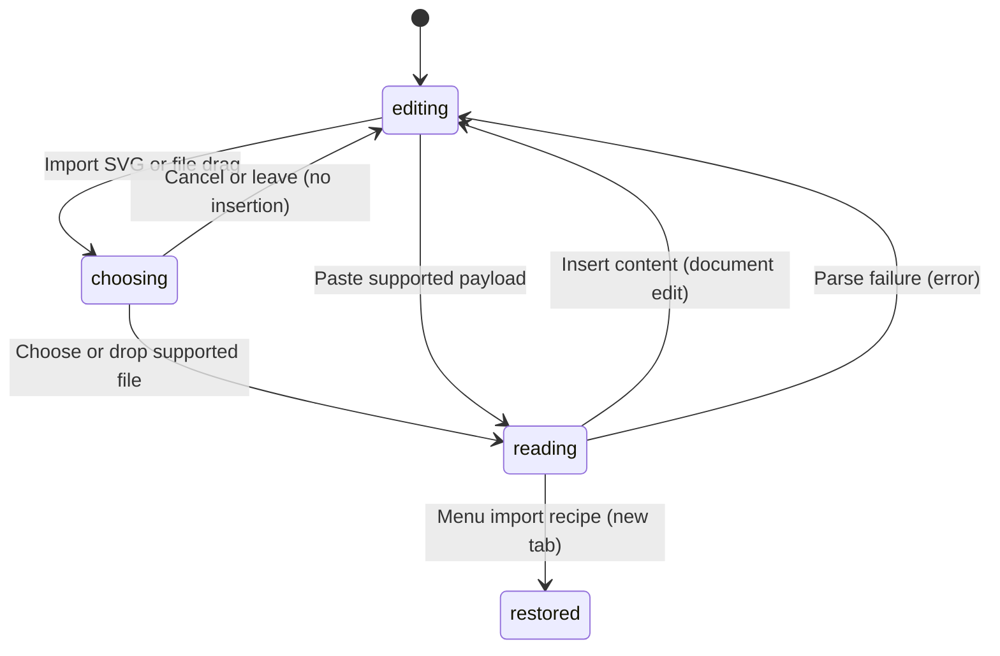

# Import and clipboard

## Summary

Import SVG brings vector artwork into the active canvas. Dropping SVG, PNG, or
JPG files places artwork at the drop point. Clipboard paste preserves editable
PunchPress objects when an internal payload exists; otherwise plain text becomes
Text. Clipboard image files are currently swallowed without insertion.

An SVG exported by PunchPress can contain an editable recipe. Import SVG opens
that recipe as a new file tab, while dropping it adds a frameless group to the
current design. These are deliberately different operations.

## The simple case

Drop a PNG onto the canvas. It becomes a selected Raster layer centered on the
drop point. Its aspect ratio is preserved and its longest placed side is at most
720 document units. A success toast names the imported file.

Select that layer and copy, then paste with canvas focus. A new editable object
appears and becomes selected. Repeated paste makes more copies with fresh
identities, ordinarily stepped diagonally from the source. Undo removes a paste
as a document edit.

## The interaction, event by event

The five phases are entering a drop or invoking Import/Paste, abandoning it,
accepting content, reading/parsing it, and inserting or restoring the result.

### Press: choose the route and destination

Import SVG opens a file chooser. An ordinary external SVG is centered in the
current viewport. A file drop converts the pointer location to a workspace
point at drop time. That captured location remains the target while bytes load.

Copy and paste are captured at the document level, but yield to inline editing,
text inputs, selects, menus, and dialogs. Copy requires an object selection.
Copying Text also offers its characters to other apps; non-Text artwork uses a
space as its plain-text fallback.

### Release without dragging: abandon or unsupported input

Canceling Import SVG adds nothing. Dragging files over the canvas advertises a
copy operation, but insertion happens only on drop. An unsupported drop shows
“Drop a SVG, PNG, or JPG file to import artwork.”

An empty plain-text clipboard produces no object. Clipboard file items are
prevented from reaching default handling but are not imported. This includes
image clipboard files, despite image support in OS file drops.

### Begin dragging: resolve the payload

For a file list, the first SVG wins over all raster files, regardless of list
order. If no SVG exists, the first supported PNG/JPEG wins. Only one file is
imported from a multi-file drop. PNG and JPEG can be recognized by MIME type or
filename extension; GIF and WebP are not in this local-file importer.

Paste first uses PunchPress's custom payload, then its embedded HTML payload.
Only without either does it examine file items, then nonempty plain text. Plain
SVG text is not sent to the SVG importer by this clipboard path.

### While dragging: parse and normalize

Ordinary SVG import creates an outer group named Imported SVG. Supported paths,
compound paths, and shapes become editable Path nodes. Nonempty nested groups
are retained, with names taken from SVG labels/names where available. Geometry
and handles are transformed into the imported layout rather than simplified.

Gradient-painted paths, unsupported item classes, invisible items, clipping
mask items, guides, and locked imported items are skipped by the normalization
path. An SVG with no supported artwork fails. A partially supported SVG can
succeed with missing content; success is not a full-fidelity guarantee.

Raster import reads image data, decodes intrinsic dimensions, then scales down
only if the longest side exceeds 720. It does not enlarge smaller images. File
read or decode errors surface as import errors.

### Release: insert or restore

An ordinary SVG or raster insertion selects the inserted root objects and is
undoable. Existing document content remains. Internal clipboard paste duplicates
object identities while retaining editable properties and copied hierarchy.

A valid embedded recipe selected through Import SVG restores a separate file
tab with no `.punch` handle. It remains unsaved until a file is chosen. The same
recipe dropped onto the canvas strips Frames, remaps identities, and wraps
content into a group centered at the drop point. That group can be parented into
the Frame under the drop point. Recipe images without usable image data are
skipped and counted in the success toast. Corrupt or unsupported embedded
metadata reports an error rather than silently falling back to geometry.

Plain-text paste normalizes line endings, collapses line breaks and surrounding
whitespace to spaces, trims the result, and creates selected Text using the
default font. This is not rich-text paste.

## Modifiers

| Modifier | Set at the start | Changed while dragging |
| --- | --- | --- |
| Shift | No separate importer variant is defined; OS chooser behavior applies. | No app-level axis or size modifier for file drop; device behavior needs checking. |
| Alt/Option | File drop advertises copy, not an Alt-selected move operation. | No live alternate importer; check OS drag feedback. |
| Ctrl/Cmd | Standard Copy/Paste reaches clipboard events; Cmd/Ctrl+J duplicates selection through the engine. | Modifier changes do not reinterpret accepted file bytes; repeated paste creates further copies. |
| Space | Inputs keep text spaces; canvas Space requests temporary pan. | Drop placement uses the view at drop time; pan during an OS drag needs checking. |

Paste placement is engine policy; modifier changes do not select a different
payload format after the paste event is accepted.

## Cancel and interrupt

| Event | Before dragging | While dragging |
| --- | --- | --- |
| Escape | Cancel the chooser or OS drag before acceptance. | No async import abort is exposed; native Escape during reading needs checking. |
| Switching tools | Does not select a different file importer. | The captured import continues without a tool cancellation hook; verify tool state after insertion. |
| Menu opening or undo/redo | Focused popups suppress object clipboard handling. | Undo before async insertion may affect preceding content; verify completion order. |
| Window loses focus | Copy/paste needs the focused application's clipboard event. | File decoding is not canceled by blur; OS drag termination needs observation. |
| Pointer leaves the window | No insertion without a drop accepted by the canvas. | After drop, the target point is captured; moving the pointer does not relocate it. |
| Reload or tab close | Abandoning an unaccepted drop adds nothing. | Pending imports have no persisted recovery queue; tab/editor lifetime races need checking. |
| Target changed or deleted | Ordinary import adds content rather than replacing selection. | Recipe parenting considers the destination at insertion; verify deleting/moving its Frame while loading. |
| Touch cancel or second input device | Clipboard and file transfer support depends on platform. | No explicit importer rollback for device takeover; verify supported devices. |

Import errors leave existing artwork intact in the reviewed parse-before-insert
paths. There is no promise that a successfully normalized partial SVG contains
every element of its source.

## Interactions with other systems

**Containers and groups.** Copy preserves copied descendants. Ordinary SVG uses
an Imported SVG wrapper; recipe drop removes production Frames and inserts a
reusable content group. Menu recipe import restores a whole document instead.

**Selection and locked/hidden objects.** Imported roots become selected. Copy
uses the existing selection; input focus can prevent object-level copy/paste.
External SVG visibility filtering differs from preserving internal source data.

**History.** Each engine paste or insertion runs as a document action. Copy does
not add artwork history. A new recipe tab has its own loaded-document history.

**Zoom.** Paste normally advances by 120 document units in x and y for each
repeat. If stepped content would be entirely outside the viewport, it is
recentered, with subsequent repetitions offset from that view center. Fresh
copy resets the sequence. This is not a fixed screen-pixel offset.

**Offline.** Local file and internal clipboard parsing do not require asset
search. SVG dependencies, font availability, and app load are separate limits.

**Touch and stylus.** OS drag/drop and clipboard presentation vary by device;
mouse results do not establish touch file transfer support.

**Collaboration.** Pasted objects get fresh identities. This supports copying
between local designs, not shared editing or cross-device synchronization.

## Edge cases

- A group containing unsupported SVG elements can import partially without a
  skipped-element warning. Check the rendered result against the original.
- A malformed custom clipboard payload is parsed before any generic fallback;
  error handling for that browser event needs verification.
- External clipboard images are a source-supported gap relative to the existing
  clipboard product contract. Use the separate image-paste regression check.
- Duplicate selection defaults to a 120-by-120 document-unit offset and retains
  source-root parents; Alt-drag duplication belongs to the moving description.

## Open questions and verification

Verify mixed-file precedence, partial SVG fidelity, corrupt metadata, clipboard
focus exclusions, offscreen placement, and async tab-switch completion. Image
paste should be assessed as a supported-contract gap, not described as working.

Evidence: canvas file-drop importers, `use-canvas-drop.ts`, SVG/image platform
modules, clipboard event/actions/placement modules, and clipboard/SVG recipe/
image-import tests. See [the checklist](../verification/documents.md#import).

Source reviewed against PunchPress commit `d4e6d4a`. Status: drafted.
