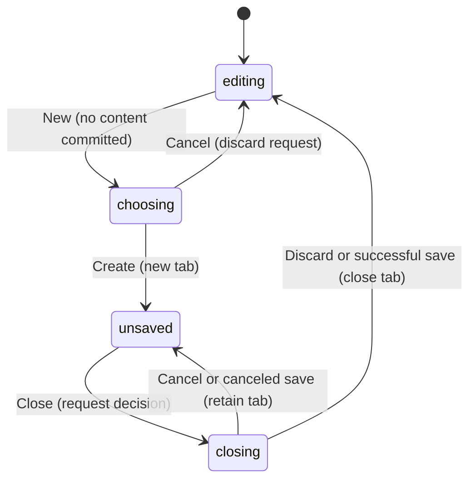

# Workspace tabs and Scratchpad

## Summary

Tabs keep several designs open in one window. Scratchpad is the permanent first
tab and stores its content locally. New File creates another tab, with a chosen
Frame or an empty workspace. A new file tab remains unsaved until it has a file
handle, even when it contains no artwork.

The New command is available through document controls and Cmd/Ctrl+N outside
inputs, menus, and dialogs in the browser. Native desktop commands have a
separate delivery path described in [desktop](desktop.md).

## The simple case

Choose New. In New File, keep Amazon Merch selected and choose Create. A new
tab opens with a 4500 × 5400 Frame named Amazon Merch and the view scheduled to
fit it. The tab is dirty because it has not been saved.

Edit the design, then click Scratchpad. Returning to the file tab restores that
editor's content, selection, view, and undo history. Switching does not close
the other editor or save its file. Use [Save](files.md) to write it.

Close the dirty tab. PunchPress focuses it and asks whether to save, discard,
or cancel. Cancel keeps it open. Discard closes it without writing a file. Save
closes it only after the save succeeds; canceling the file chooser keeps it open.

## The interaction, event by event

The five gesture phases map here to opening a dialog, dismissing it untouched,
choosing settings, keeping the dialog open, and submitting or closing a tab.

### Press: open or focus

Clicking a tab makes its editor active. Clicking New opens a modal before any
new document exists. The first dialog selection is Amazon Merch. Later openings
retain the dialog's current selection and custom text while the component lives.

Scratchpad is always present and has no close operation. Its dirty indicator is
suppressed; this means it is excluded from file prompts, not that every pending
local write has completed.

### Release without dragging: leave without creating

Cancel closes New File without adding a tab. Focusing an existing tab changes
the active editor without adding a document undo step. Closing a clean file tab
does not ask for a save decision.

### Begin dragging: choose the starting document

The choices are Amazon Merch (4500 × 5400), Square POD (5000 × 5000), Social
Square (1080 × 1080), Custom Size, and No Artboard. The last choice creates an
empty workspace; a Frame is optional.

Custom dimensions are read when Create is pressed. They are parsed as integers,
clamped to at least 1, and fall back to 4500 or 5400 when no integer can be
parsed. Decimal text truncates rather than producing fractional Frame sizes.
There is no upper limit in this dialog's validation.

### While dragging: editing and local persistence

Each tab retains its editor instance. Only the active one receives the normal
window listeners and clipboard bridge. Switching changes which editor the
canvas displays rather than serializing one design into another.

Scratchpad schedules a local save 400 ms after its latest editor-state change.
Subsequent changes restart that timer. This is browser-local storage, with no
file chooser and no recent-document entry. Loading Scratchpad is asynchronous
at startup; storage errors are logged rather than displayed in a save toast.

> Technical note: Scratchpad uses IndexedDB through `idb-keyval`, not
> `localStorage`. The active-Scratchpad effect clears its timer on cleanup and
> does not flush it when switching tabs.

### Release: create or close

Create appends and focuses the new file tab. A preset adds a Frame at the
workspace origin. The old tab stays available.

Closing the active file tab selects the preceding surviving tab, usually the
one to its left. Closing another clean tab leaves the active tab selected.
Closing a dirty inactive tab first focuses it so its save decision concerns that
design. Scratchpad remains when every file tab has closed.

Desktop quit processes dirty file tabs one by one. Cancel stops the quit;
earlier successful saves remain saved. Browser reload uses a browser-controlled
unsaved warning for dirty file tabs, not this sequence of app dialogs.

## Modifiers

| Modifier | Set at the start | Changed while dragging |
| --- | --- | --- |
| Shift | No separate New variant; Cmd/Ctrl+Shift+N also reaches New in the browser document mapping, with possible competing editor shortcut behavior requiring verification. | Field selection follows normal input behavior; no alternate Create policy. |
| Alt/Option | Alt prevents the browser document shortcut from matching. | No alternate tab or preset policy is defined; native focus behavior needs checking. |
| Ctrl/Cmd | N invokes New outside blocked focus targets. | New File inputs retain field shortcuts; repeated native invocation needs verification. |
| Space | Space in dimension inputs stays input text. | Popup Space outside fields has the shared temporary-pan question from input foundations. |

Keys do not change the dimensions after Create has captured the request.

## Cancel and interrupt

| Event | Before dragging | While dragging |
| --- | --- | --- |
| Escape | Ordinary editor Escape acts on selection/tool. | Dialog dismissal resolves a pending dirty-close choice as Cancel; verify New File dismissal with the UI. |
| Switching tools | Uses that tab's editor. | Modal blocking suppresses conflicting editor commands; tab-switch delivery through open dialogs needs observation. |
| Menu opening or undo/redo | Undo changes the active design, not tab order. | Dialog input focus blocks ordinary editor shortcuts; native menu behavior needs checking. |
| Window loses focus | Clears temporary input modifiers. | A Scratchpad timer is not canceled merely by blur; native dialog focus and close decisions need checking. |
| Pointer leaves the window | No tab action is submitted merely by leaving. | Button press cancellation and return focus depend on UI delivery; verify on the target device. |
| Reload or tab close | Dirty file tabs request browser protection; Scratchpad does not. | Pending Scratchpad writes can be lost; a pending new-file form is not persisted. |
| Target changed or deleted | Closing a clean tab removes it. | Save/discard concerns the captured dirty tab; simultaneous close requests are rejected while a choice is pending. |
| Touch cancel or second input device | Tab and dialog controls require device verification. | No special touch recovery contract is established. |

Canceling a close retains the tab, but the focus change that exposed the dirty
tab is not rolled back.

## Interactions with other systems

**Containers and groups.** Tabs own whole documents. A preset creates a Frame;
it does not transfer groups from the previously active design.

**Selection and locked/hidden objects.** Each editor retains its own selection
and object visibility/locks during ordinary tab switches.

**History.** Each editor keeps its own undo history in memory. Closing a tab
discards that session history. Reopening a file starts a loaded-document history.

**Zoom.** Views belong to individual editors while tabs stay open. Do not infer
that Scratchpad serialization persists the viewport: its serializer saves nodes.

**Offline.** Local Scratchpad storage does not require a network request once
the app runs. First-load availability and storage quota remain platform limits.

**Touch and stylus.** Tab controls are distinct from canvas gestures; their
pointer cancellation and focus behavior are unverified.

**Collaboration.** Tabs are local editors. No shared-tab or synchronized
Scratchpad session is defined by this implementation.

## Edge cases

- A blank new file is still dirty because it has no file handle.
- Desktop path strings deduplicate opened tabs; browser file handles do not
  participate in that tab-key comparison. Reopening a browser file can add a tab.
- Suspected data-loss defect: edit Scratchpad, switch to a clean file tab within
  400 ms, then reload without revisiting Scratchpad. The canceled save timer can
  leave the previous stored content as the restored design.
- Existing product docs promise already-open-file focusing generally. The
  browser/desktop distinction above is a source-observed gap in that promise.

## Open questions and verification

Check startup edits racing restored Scratchpad content, rapid tab switches,
multi-tab dirty close, and custom dimension validation in the UI. The debounce
loss and browser duplicate-tab behavior need product decisions and reproductions.

Evidence: `workspace-provider.tsx`, `scratchpad-storage.ts`, `new-file-dialog.tsx`,
`new-file-presets.ts`, and document command/unsaved-warning hooks. See
[the checklist](../verification/documents.md#workspace-tabs).

Source reviewed against PunchPress commit `d4e6d4a`. Status: drafted.
