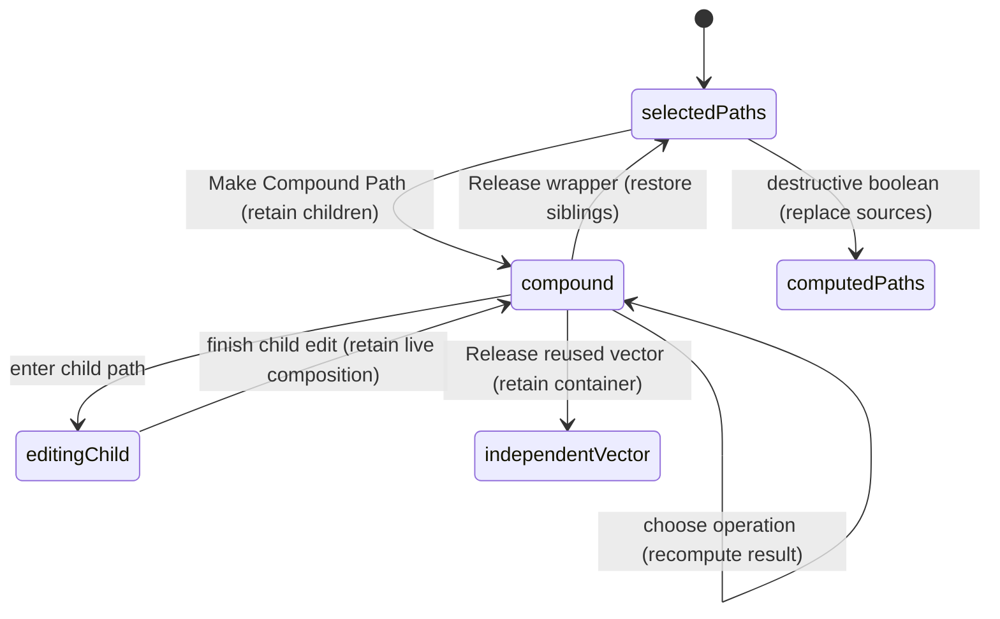

# Compounds and vector composition

## Summary

A compound combines editable child paths into one live vector result. Make
Compound Path defaults to Unite. The child paths remain available in Layers
and for point editing; changing Unite, Subtract, Intersect, or Exclude recomputes
the visible result without discarding those source paths.

Release Compound Path restores independent source rendering. Destructive boolean
actions also exist, but replace their source geometry with computed paths and
do not promise a releasable compound.

## The simple case

Select two closed sibling paths and invoke Make Compound Path. A selected vector
named Compound replaces their separate outer rows, with both original paths as
children. Their overlapping silhouettes become one Unite result.

Change the compound operation to Subtract, then back to Unite. The same child
paths produce the new result. Release Compound Path removes a newly created
wrapper and selects the restored child paths at their former parent level.

## The interaction, event by event

### Press

The command evaluates the current selection before changing the document. The
reviewed Make Compound Path action accepts two or more closed sibling paths,
or one independent vector containing at least two closed child paths.

Selecting every closed child path of an independent vector reuses that parent.
Selecting only some children is rejected: it does not silently change the
composition of unselected siblings. Open contours are not eligible for Make.

Raw shape selection is not eligible in this action. Convert shapes to paths
first. The separate destructive boolean action accepts path, shape, and vector
sources; this distinction corrects a broader statement in the older docs.

### Release without dragging

Make is an immediate document command. It does not need a canvas drag or a
confirmation dialog. When eligibility fails, it makes no compound.

Eligible standalone paths become children of a new vector named Compound with
Unite composition. Their existing path identities and editable geometry remain.
If an eligible vector already owns the paths, its composition changes to Unite
without adding another wrapper or replacing the child paths.

### Begin dragging

Making a compound has no extended drag phase. The extended workflow is editing
its operation, child geometry, or layer order after creation. A body drag moves
the selected vector through the ordinary [moving](../selection/moving.md) path.

Enter a child for [point editing](path-editing.md) to change the live source.
The child remains inside the compound; editing it does not release the parent.

### While dragging

Child geometry changes feed the combined result. Overlapping source strokes
are not independently painted through the union silhouette. The parent owns
one operation; different children do not each hold an independent operation.

Unite shows the combined area, Intersect keeps shared area, Exclude removes
shared overlap, and Subtract is order-dependent. Changing child order can
therefore change Subtract while preserving every child contour. Fill rules
remain a separate question from which boolean operation is selected.

The operation menu resolves the nearest vector ancestor of the targeted path.
It requires at least two child paths and a non-independent composition. A
single-child vector does not get an operation menu merely because it is a vector.

### Release

A new compound wrapper releases by removing the wrapper and restoring all child
paths to the wrapper's parent. Those children become selected. Releasing from a
child selection still releases all source paths owned by that compound.

A pre-existing vector used as a compound releases differently: it stays in
Layers with its children and changes to independent composition. Release is
therefore not a general “remove every vector container” command.

Destructive boolean results can contain several contours or child paths using
a combined fill representation. That does not make them releasable source
compounds. Their original operands return through Undo, not Release Compound
Path. The command tests explicitly distinguish these cases.

## Modifiers

| Modifier | Set at the start | Changed while dragging |
| --- | --- | --- |
| Shift | Can build the required multi-object selection; it does not select a different compound operation. | Compound body/child drags follow the linked move or path-edit modifier rules. |
| Alt/Option | No Make/Release variant is defined. | Whole-object duplicate dragging follows moving; direct handles follow path editing. |
| Ctrl/Cmd | Shortcut/menu dispatch uses normal focus rules; no alternate composition is implied by a modifier alone. | No compound-specific gesture variant; existing point/body interactions own it. |
| Space | Enables temporary pan for subsequent canvas input; the compound command is discrete. | Pan takeover while editing a child needs the underlying gesture verification. |

## Cancel and interrupt

| Event | Before dragging | While dragging |
| --- | --- | --- |
| Escape | Dismisses relevant menu/edit selection according to focus; a completed Make is undone through history. | Underlying body/point edit owns Escape; the compound is not automatically released. |
| Switching tools | Does not change a completed compound operation. | Child editing may end under the tool rules; sources stay in the compound. |
| Menu opening or undo/redo | Menus select an operation; Undo can restore the preceding independent paths. | Live child-drag/history interleaving needs verification; no asynchronous Make job is pending. |
| Window loses focus | Does not release or reconfigure an existing compound. | Clears temporary modifiers; body/point gesture delivery remains the relevant question. |
| Pointer leaves the window | No effect on an already-completed compound command. | Outside release behavior follows body/point editing, not a special composition listener. |
| Reload or tab close | Ends the editor session; saved compound relationships belong to document loading. | A child edit's persistence depends on whether it committed; verify interrupted restoration. |
| Target changed or deleted | Make/Release re-evaluates current nodes and child eligibility. | Removing/changing operands changes the live source set; deletion during a point preview needs checking. |
| Touch cancel or second input device | Make/Release has no held pointer session of its own. | Body/corner/point cancellation behavior remains feature-specific. |

## Interactions with other systems

Containers and groups: same-parent eligibility preserves a meaningful place in
the layer tree. Groups are not direct Make operands. Existing vectors can be
reused; newly created compound wrappers are the ones removed on release.

Selection and locked/hidden objects: selecting the vector addresses the visual
result; selecting an eligible child can address its parent operation. The Make
predicate does not itself filter lock or visibility, so command affordances and
rendered hidden operands need direct verification rather than an assumed rule.

History records Make, operation changes, and Release as document changes.
Child geometry stays editable across those actions. Undo is essential when the
chosen operation was destructive rather than live.

Zoom changes display scale, not the chosen set operation or stored child order.
Offline compilation uses the local vector geometry backend; no server request
appears in the inspected composition actions.

Touch and stylus have no distinct Make/Release semantics, but editing child
geometry still needs physical-device checks. Collaboration/concurrent operand
replacement is not established for this editor surface.

## Edge cases

The command labels Make Compound Path and Release Compound Path reflect current
eligibility, not a promise that every vector can make or release. A partial child
selection of an independent vector is insufficient for Make, while even one
selected child can identify a releasable compound and release its whole source set.

A destructive subtraction that yields multiple contours can look like a live
compound in the canvas. The presence of separate-looking holes is not evidence
that the original operands remain recoverable through Release.

Do not use Merge Curves as a synonym. Merge changes several path objects into
one multi-contour path with one style; Make retains source child paths inside a
live operation. Ordinary Group preserves separate artwork without boolean merging.

## Open questions and verification

- Verify ordered subtraction with differently styled children, hidden operands,
  and release after vector move/resize/rotate. The inspected release action
  preserves child records; visual transformed placement still needs a UI pass.
- Confirm that disabled menu states communicate raw-shape and partial-child
  ineligibility clearly. The old docs' wider claim is a documentation mismatch,
  not sufficient evidence of a product defect.
- Evidence: path-compound-actions, path-composition-actions, path-boolean-actions,
  operation-menu targeting, and compound/composition contract tests.
  [Compound checklist](../verification/vector.md#editingcompoundsmd).

Source reviewed against PunchPress commit `d4e6d4a`. Status: drafted.
