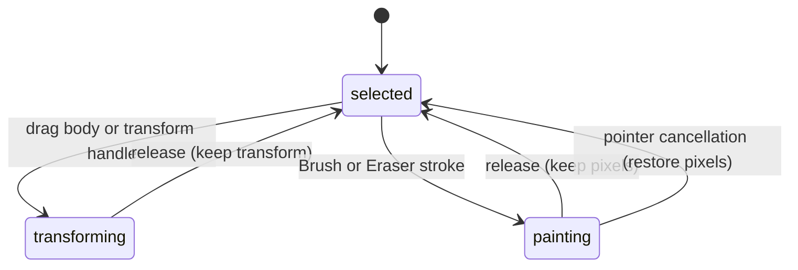

# Raster layers and image editing boundaries

## Summary

Raster layers contain pixel artwork, including imported images and painted
layers. They support ordinary selection, transforms, visibility, and
Brush/Eraser edits. This baseline does not expose a crop tool, editable image mask,
or automatic background cutout command. Frame clipping and erasing pixels are
available, but have different consequences from those absent features.

## The simple case

Import an image using the [import workflow](../documents/import.md). Select it
and move, resize, or rotate it using the same handles as other artwork. Image Properties exposes Width and Height controls.

Use Eraser to remove pixels from the image, then Undo to restore them. To constrain
production output to a region, use a Frame and its export boundary. That is not an
independent crop rectangle stored on the image.

## The interaction, event by event

### Press

Pointer targeting selects the image through the shared group and selection
rules. Brush targeting is different: the directly hit Raster layer can win over a
selected raster elsewhere. See [Brush and Eraser](../tools/brush-and-eraser.md).

The image's width and height describe its logical raster plane. Pixel transparency
does not by itself remove the object from Layers. Layer naming and visibility are
owned by [Layers](../workspace/layers.md).

### Release without dragging

A Pointer click selects artwork without changing its pixels. A Brush click can
paint one dab; an Eraser click can remove a circular patch. No click-only crop or
mask creation action exists in the reviewed controls.

### Begin dragging

Dragging the object enters the ordinary move session. Dragging a transform handle
enters resizing or rotation. These actions change the placement of the raster
artwork rather than invoking an independent image-editing screen.

Beginning a paint stroke loads a working pixel surface. It does not rewrite the
saved pixel asset on every movement.

### While dragging

Transforms display the ordinary shared preview. Pixel strokes show live paint or
transparency. An existing unclipped image keeps its plane during ordinary brush
commits; a stroke extending outside it can increase the logical bounds while
pinning existing pixels in place.

A directly Frame-parented raster clips new paint using the Frame's bounds mapped
into raster-local space. A subsequent paint commit can trim an oversized child
raster to those bounds. For rotated rasters this is a bounding rectangle, not a
proven exact clip to the Frame outline. This pixel-storage change is distinct
from merely viewing clipped artwork or exporting a Frame.

### Release

Release keeps a changed transform or commits the stroke. A pixel edit writes a
new PNG representation; imported JPEG content can remain in its original form
until edited. Image alpha remains available for transparent export where the
chosen export format supports it.

Fully erasing a layer leaves the Raster layer present and selected. Erasing
transparent space does not expand its dimensions. Saving should retain the
raster assets, including large tiled content; see [files](../documents/files.md).

## Modifiers

| Modifier | Set at the start | Changed while dragging |
| --- | --- | --- |
| Shift | Uses shared selection/transform rules. | Uses shared resizing/rotation constraints; Brush has no Shift constraint. |
| Alt/Option | Alt-start move duplicates through the move workflow. | Does not become duplicate after a normal move started. |
| Ctrl/Cmd | Uses shared selection and command routing. | No image-specific modified crop or mask mode. |
| Space | Requests temporary pan for a new canvas press. | Active gesture ending is owned by move, transform, or brush, not by image type. |

## Cancel and interrupt

| Event | Before dragging | While dragging |
| --- | --- | --- |
| Escape | Uses the current Pointer or raster-tool Escape action. | Move/transform listeners do not promise rollback; Brush tool switching also needs verification. |
| Switching tools | Chooses next interaction. | Follow the active move/transform or stroke owner; tool switching is not a universal cancellation. |
| Menu opening or undo/redo | Menu/Undo follows workspace commands. | Undo during an image gesture needs the owning session check. |
| Window loses focus | Clears Space state. | No additional image-specific blur recovery is defined; verify active-session cleanup. |
| Pointer leaves the window | No pixel mutation from leaving alone. | Outside release behavior belongs to the active gesture and requires observation. |
| Reload or tab close | Ends the page session. | Committed image assets can be saved; working pixels and transient transforms need their persistence checks. |
| Target changed or deleted | Selection targets current image identity. | Deletion during an active transform or pending paint commit needs verification. |
| Touch cancel or second input device | Touch image selection is not established by mouse tests. | Brush pointercancel restores; moved/resized/rotated selection pointercancel commits. Physical device delivery remains unverified. |

## Interactions with other systems

**Containers and groups.** Frame clipping, group membership, and image storage are distinct. A nested group does not satisfy the Brush direct-Frame-parent clip check.

**Selection and locked/hidden objects.** Hidden images follow shared visibility rules; selection and lock eligibility are owned by [selecting](../selection/selecting.md).

**History.** Transforms and strokes have their own history boundaries. Stored image opacity is distinct from Brush opacity; no layer-opacity control was found in the image panel.

**Zoom.** Zoom changes on-screen scale without changing stored resolution. Large tiled images can show a lower-resolution projection at extreme zoom-out; panning should not shift its pixels.

**Offline.** Editing local embedded image data has no cutout service or network inference request. Loading remote source content is outside this local-image statement.

**Touch and stylus.** There is no image-specific pressure or touch crop affordance in this baseline.

**Collaboration.** There is no described shared image-edit conflict policy or synchronized pixel cursor.

## Edge cases

- Raster layer is the product term; the stored node family is image. Layer count does not increase just because a large image uses multiple stored tiles.
- No durable crop rectangle, editable mask attachment, or cutout action was found in the schema, engine, or image property UI. These are missing capabilities, not broken implemented features.
- Brush masks are circular stroke coverage calculations; they are not user-editable image masks.
- SVG import clip masks are not a general image masking editor. Unsupported import fidelity belongs to import documentation.

## Open questions and verification

- Verify transformed imported images, opacity, Frame-edge erasing, nested Frame/group clipping, and transparent output in the browser.
- Evidence: image model/capabilities, raster renderer, Brush target and commit code, raster-brush E2E tests, and image-import platform tests.
- Product decision: if crop, masks, or cutout are desired, define them separately rather than interpreting the Frame/Brush behavior as an already-shipped equivalent.
- Checklist: [Image checks](../verification/text-raster.md#editingimagesmd).

Source reviewed against PunchPress commit `d4e6d4a`. Status: drafted.
