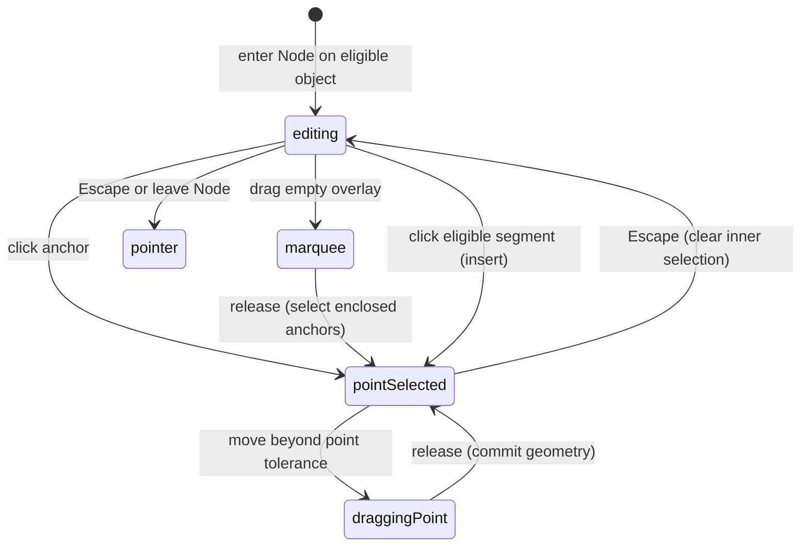

# Editing paths and corners

## Summary

Node edits anchors, handles, and corners inside a selected path or live shape.
Press A with one eligible object selected, double-click editable artwork, or
click it with Node active. Point controls replace the ordinary transform frame.
A vector container can keep its whole visual result while one child path owns
point editing.

Selected anchors can move, become Corner or Smooth, be deleted, or participate
in Split path, Join endpoints, and Close curve. Merge Curves, Separate Curves,
and Join Curves operate on compatible whole path selections.

## The simple case

Select a path, press A, and click one anchor. Drag it and release. The adjacent
segments follow that anchor while the other anchors stay in place. The edited
path remains selected and Node remains active.

Shift-click another anchor, then drag an already-selected anchor. Both selected
anchors move together. Press Escape to clear inner point selection; press Escape
again to leave the editing context and return to ordinary Pointer selection.

## The interaction, event by event

### Press

Anchor and handle hit targets take precedence over the path body. A normal
anchor press preserves a multi-point selection if that anchor is already in it;
otherwise it selects that anchor. Shift-click toggles that anchor's membership.
The Shift-toggle path does not also begin an anchor drag from that press.

A segment press prepares insertion; a path-body press clears inner point
selection and prepares whole-object movement. Empty space prepares a rectangular
point marquee. This is not the object marquee described under
[selection](../selection/selecting.md).

### Release without dragging

An anchor click selects without changing the document. An eligible segment click
inserts at that curve position and selects the new anchor. The segment is split
so its existing visible curve is retained, rather than replaced by a straight
shortcut between neighboring anchors.

Clicking empty canvas without Shift exits the current path editing context.
If the release targets another eligible object, it can enter that object's path
editing instead; a noneditable object becomes the ordinary selection. A click
on a corner-radius widget selects its logical corner even without changing size.

### Begin dragging

Anchor/handle and corner-radius drags use their respective 4-screen-pixel
thresholds. Point marquees use the same named distance with a separate behavior.
Body and pending-segment drags instead route to whole-object movement; dragging
a segment with Node does not promise the Pen tool's insert-and-author-handles
behavior.

A point drag opens one geometry history step. Corner-radius dragging captures
the original geometry and available radius so repeated moves do not accumulate
rounding error or progressively shrink the admissible range.

### While dragging

A selected anchor follows the pointer in the path's coordinate system. Dragging
one member of a selected set offsets all selected anchors, preserving their
relative arrangement. There is no scale/rotate transform box for that point set;
keyboard nudging is another translation path.

A smooth handle keeps its opposite side tangent-aligned. A corner handle edits
independently. Option on a handle breaks smooth coupling; Option-dragging an
anchor creates smooth handles instead of moving the anchor. Shift constrains
handle angles, including the Option-anchor conversion gesture. Ordinary anchor
translation has no corresponding angle-lock branch here.

A single open endpoint can snap to a compatible endpoint while dragged. The
endpoint target uses a 14-screen-pixel snap distance. A multi-anchor drag clears
that endpoint target rather than joining every selected point.

Corner widgets edit eligible logical corners. With no selected corners, the
visible all-corner affordance can apply a shared radius; selected-corner scope
restricts the edit. The drag clamps to geometric feasibility and displays limit
feedback. A rounded corner remains one logical corner for selection/deletion.

### Release

Point/handle previews write back once and the drag's history step commits.
Endpoint release applies the previewed close/join topology and updates point
selection to the surviving endpoint. Corner dragging also commits one marked
step when it changed the radius; a click only selects the corner.

Point deletion preserves remaining valid geometry where possible. If too little
editable geometry remains, the path is removed, including empty-container cleanup.
A polygon's live-shape deletion rules are stricter; see
[Shape edge cases](../tools/shape.md#edge-cases).

Split path opens a closed contour at the selected point, or divides an open
contour at an interior point into two contours in the same path. Close curve
connects the ends of an eligible open contour. Join endpoints is a distinct
command: its current same-contour implementation removes the last anchor while
closing, even if the endpoints are not coincident. This is a suspected geometry
loss bug, not interchangeable wording for Close curve.

Merge Curves takes compatible sibling paths into one multi-contour path using
the first selected path's identity and style. Separate Curves makes one path per
contour with that shared style; it cannot recover each source's prior styling.
Join Curves joins the nearest endpoints of two eligible open paths. Neither
Merge Curves nor Join Curves is the live compound operation described in
[compounds](compounds.md).

## Modifiers

| Modifier | Set at the start | Changed while dragging |
| --- | --- | --- |
| Shift | Toggles anchor membership or fixes an additive point marquee at press. | Constrains handle/Option-anchor angles; marquee additive state remains the value captured at press. |
| Alt/Option | Anchor drag authors smooth handles; handle drag breaks coupling. | Modifier state is read on each point-drag update, so coupling/conversion can change live. |
| Ctrl/Cmd | Cmd while Pen is selected enables this direct editing surface without changing tools. | Mid-gesture Pen handoff needs verification; no Node-specific alternate point movement is defined. |
| Space | Temporary pan suppresses normal editing overlay input. | Pan/point-drag takeover and return need verification; no point rollback follows from the modifier alone. |

## Cancel and interrupt

| Event | Before dragging | While dragging |
| --- | --- | --- |
| Escape | Clears inner anchor/corner selection before exiting Node on a later Escape. | Paper drag termination and preview rollback after the dispatched key need verification. |
| Switching tools | Leaving Node exits editing except the handoff to Pen. | Overlay teardown removes tool handlers; commit versus discard of a pending point preview needs a browser check. |
| Menu opening or undo/redo | Commands re-evaluate point/object scope; history changes geometry. | Pending scene updates coexist with the overlay drag; interrupted writeback needs verification. |
| Window loses focus | Clears temporary modifiers. | Paper-owned pointer cleanup is unverified; corner widget has no blur cancel listener. |
| Pointer leaves the window | Hover feedback can leave the target; no geometry edit from hover alone. | Outside release behavior is dependency-owned for points; corner widgets listen on window. |
| Reload or tab close | Ends this editing session; restoration belongs to workspace loading. | Transient previews are not a completed geometry writeback; do not assume the draft is recovered. |
| Target changed or deleted | An unavailable target cannot supply an editable session. | Scene refresh/writeback interaction needs observation; corner update rejects an invalid session. |
| Touch cancel or second input device | Device-equivalence is unverified. | Corner-radius pointercancel commits changed radius, a supported inconsistency; Paper point cancellation needs separate checking. |

## Interactions with other systems

Containers and groups: Node can focus the nearest group ancestor while directly
entering a descendant. Inside a vector, one path owns editing while the container
remains the visible composition. Point deletion can remove an empty owner.

Selection and locked/hidden objects: inner anchors are a different selection
from Layers objects. Editing one path does not make every visible vector child
part of its anchor selection. Canvas visibility and command lock policy require
separate checks; no universal bypass or protection is claimed.

History excludes anchor selection, includes geometry commands, and groups point
or corner drags. Merge/Separate changes object identity/order as described above.

Zoom projects handles and widgets into screen space; the point and corner drag
thresholds are independent of Pen's authored-handle exception.

Offline point editing uses local geometry. Touch and stylus input travel through
different browser/dependency paths and have not been physically verified.
Collaboration-driven topology changes during a drag are not established.

## Edge cases

Corner conversion collapses both handles. Smooth conversion materializes
continuous handles. A corner may also have independent handles after direct
editing; “corner” does not always mean “both handles permanently absent.”

Merge accepts different source styles without a style-compatibility guard and
retains the first path's style. This is a supported product question because
existing docs describe preserving unrelated styling. Separate does not undo
this information loss; Undo does.

Same-contour Join endpoints currently removes the trailing anchor without a
coincidence check. Separate-contour joining does distinguish coincident endpoints.
A three-point open path can therefore become a two-point closed path through
Join endpoints. The contract test currently asserts this reduction.

## Open questions and verification

- Suspected defects/product decisions: same-contour Join endpoints loses a
  noncoincident endpoint; Merge Curves loses other source styles; corner-radius
  pointercancel commits the partial edit. Each has a P1 checklist item.
- Verify overlay teardown during a point drag, focus loss, keyboard nudging,
  endpoint feedback, and selected-corner controls through real input.
- Evidence: Paper session tool/interaction, corner-radius widget, path point,
  curve, and topology actions; corresponding editor-contract tests.
  [Path-edit checklist](../verification/vector.md#editingpath-editingmd).

Source reviewed against PunchPress commit `d4e6d4a`. Status: drafted.
