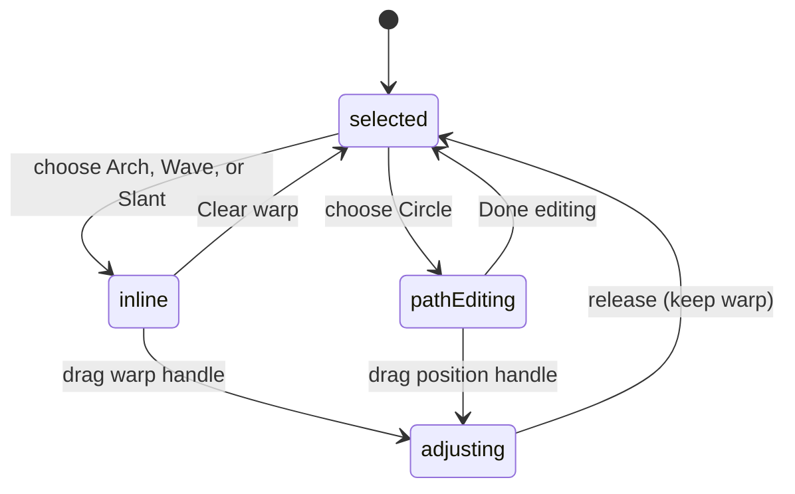

# Text warps and path positioning

## Summary

The Warp section bends live text into Arch, Wave, Slant, or Circle. Wording and
font remain editable. Arch, Wave, and Slant expose inline controls on selected
text; Circle has a distinct path-editing mode and a handle that slides wording
around its circle.

## The simple case

Select text and choose Wave in Properties. Its lettering follows a restrained
wave. Drag the amplitude handle to change the height, or the cycle handle to
change how many waves fit through the lettering. Release to keep the shape.

Choose Circle to arrange text around a circular guide and enter Node path editing.
Drag the dedicated position handle around the guide to relocate the wording.
Dragging the visible letters instead moves the whole object.

## The interaction, event by event

### Press

Applying a warp replaces the previous warp settings with that kind's preset.
Arch begins at bend 0.4; Wave at amplitude 24 and one cycle; Slant at rise -120.
Circle begins outside the path with a 100-degree sweep and a radius scaled to the
text's estimated width and height.

Circle application immediately enters path editing through Node. “Edit path” and
“Done editing” expose that mode in Properties. Inline warp editing remains
separate from entering the character editor described in [text](text.md).

### Release without dragging

Clicking a warp choice applies it without dragging. Clear warp restores straight
text. Pressing and releasing an unchanged handle closes its history boundary
without a changed warp. A selected circle guide also provides an entry to path
editing; clicking empty path-edit target space exits that mode.

### Begin dragging

A warp-handle press captures the starting shape and coordinate frame. Pointer
movement then changes the relevant parameter directly; the reviewed handle loop
does not use the object-move activation threshold. Circle positioning captures
the angle at which the handle was grabbed to avoid an initial jump.

### While dragging

Arch changes bend; Wave has separate amplitude and cycle controls; Slant changes
rise. Inline handle edits pin the rendered center so reshaping does not also
translate the text. Guide icons follow the text object's rotation.

Circle positioning changes where text lies on the circle while preserving the
circle center and radius. Shift snaps that position to 15-degree increments.
Selection bounds are suppressed during position adjustment and the circle guide
remains the spatial reference. Inside/Outside changes which side carries letters
without reversing their reading order.

The panel offers Arch -2 to 2, Wave amplitude -500 to 500 and cycles 0.1 to 3,
Slant -400 to 400, Circle radius 1 to 5000, and sweep -360 to 360.
The amplitude and Slant canvas handles do not apply those panel bounds; see the
supported range inconsistency under Open questions.

### Release

A handle release commits the changed warp as one history step. Browser pointer
cancellation uses that same commit path. It does not restore the starting shape.

Ordinary text resizing and Circle path resizing differ: resizing ordinary text
scales the circular layout with the lettering, while path editing resizes the
circle radius without scaling the font size. Clear warp exits circle editing
through the shared state reconciliation.

## Modifiers

| Modifier | Set at the start | Changed while dragging |
| --- | --- | --- |
| Shift | Circle position snaps to 15-degree increments. | Snap is read on movement and can be enabled or released mid-drag. |
| Alt/Option | No alternate warp-handle mode. | No duplication in this handle loop. |
| Ctrl/Cmd | No alternate warp-handle mode. | History shortcuts are separate; interaction with an active history mark needs verification. |
| Space | Routes new canvas navigation through temporary pan. | No warp-handle rollback is established when Space changes. |

## Cancel and interrupt

| Event | Before dragging | While dragging |
| --- | --- | --- |
| Escape | Can leave Node/path-edit mode through shared tool handling. | The handle listener has no Escape rollback; actual continued adjustment requires verification. |
| Switching tools | Changes the active tool and mode. | The window-level handle session is not canceled directly by tool switching; verify continuation. |
| Menu opening or undo/redo | Opens controls or changes history. | Undo can invalidate the open history mark; verify the final parameter and undo stack. |
| Window loses focus | Clears temporary pan modifiers. | No handle-specific blur cancellation is installed; verify release outside the app. |
| Pointer leaves the window | No adjustment without movement. | Window listeners consume delivered motion; outside release requires verification. |
| Reload or tab close | Ends the page session. | Warp values update live; persistence during a held handle depends on workspace timing. |
| Target changed or deleted | Only compatible text exposes its warp guide. | Missing/incompatible target updates become no-ops; end cleanup still needs browser verification. |
| Touch cancel or second input device | Physical touch targeting needs verification. | Pointer cancellation keeps the current warp through the release handler; second-device routing needs verification. |

## Interactions with other systems

**Containers and groups.** The warp belongs to the text object. Group transforms and Frame placement do not turn it into vector paths.

**Selection and locked/hidden objects.** One selected text target supplies the guide; inline character editing and path editing are distinct modes. Hidden guide visibility follows the canvas selection system.

**History.** A canvas handle uses one history boundary. Panel numeric edits follow shared property-field history rather than the handle listener.

**Zoom.** Handle input converts from screen to object-local coordinates. A rotated or zoomed node should keep guide, lettering, and handle aligned.

**Offline.** Warping loaded text has no remote step. Fonts must be available for faithful geometry.

**Touch and stylus.** Only pointer location and Shift snapping are consumed here. Pressure and stylus tilt are not warp parameters.

**Collaboration.** Concurrent edits to the same text are not coordinated by these handle sessions.

## Edge cases

- Wave cycles clamp at three and at 0.1. Arch clamps at magnitude two on both panel and handle paths.
- Extreme negative tracking must not invert glyph order; Circle tracking is bounded before a full-circle distribution is exceeded.
- Circle position wraps around the path rather than accumulating unbounded revolutions.
- A subtle spring offset is used for Slant and Wave cycle handles; moving guide handles such as amplitude do not get that extra displacement.

## Open questions and verification

- Supported suspected inconsistency: canvas Wave amplitude and Slant can exceed the panel ranges. `transform/text-path-edit.ts` calculates these values without clamp while `text-warp-fields.tsx` clamps panel writes. Decide whether the differing ranges are intentional; see checklist P1 items.
- Pointer cancellation commits a partial warp. This shares the selection-transform cancellation question and should be triaged together rather than treated as a separate unrelated defect.
- Evidence: text-path-edit, text-path, warp layout, path-guides UI; arch/wave/slant/circle contract and E2E tests. Source/test review is not current visual verification.
- Checklist: [Warp checks](../verification/text-raster.md#editingtext-warpsmd).

Source reviewed against PunchPress commit `d4e6d4a`. Status: drafted.
