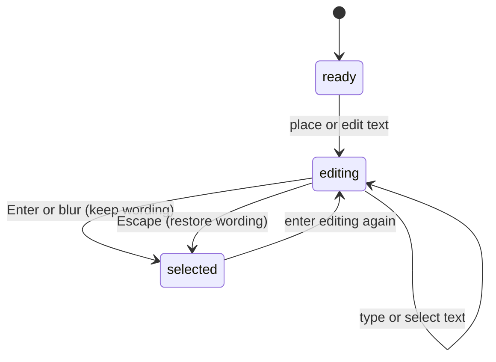

# Live text and inline editing

## Summary

Text remains editable wording with a font, size, tracking, fill, stroke, transform,
and optional warp. T selects Text outside focused inputs. Click empty canvas to
place text; click existing text with Text active to edit its wording.

## The simple case

Choose Text and click the desired center. The starter wording “YOUR TEXT” appears
in an inline editor with the caret at its end. Select the starter wording and type
your own. Press Enter to keep the result and return to Pointer.

The same object remains editable and selected. Its normal warped rendering
returns after wording editing ends; editing can show a straight version for a
usable caret without discarding the stored warp.

## The interaction, event by event

### Press

An empty-canvas press creates text immediately and centers its initial geometry
at the placement point. Starter font size and stroke width use ergonomic placement
sizing, rather than promising the raw model defaults at every zoom.

Entering existing text editing retains its selection. Pointer becomes the active canvas tool while the input takes focus with
a collapsed caret at the end; it does not select all existing text automatically.
A new text object starts unwarped with white fill and black outline.

### Release without dragging

There is no drag-sized text box. The initial press already enters editing, and
release leaves the editor focused. Clicking to edit existing text and finishing
without changing wording should not add a meaningful document history step.

### Begin dragging

The extended phase is typing or selecting characters, not creating a paragraph
rectangle. Pointer movement inside the field belongs to the browser text input
and can select a range. It does not move the whole text object.

### While dragging

Typing updates the same live text object. The preview preserves fill, stroke,
font size, and tracking. A separate caret is shown when the character selection
is collapsed; selecting a range uses native input selection. Text editing is
single-line: Enter finishes editing rather than inserting a line break.

Space inserts a normal space while the input is focused. Ordinary tool shortcuts
must not intercept typed letters. Cmd+A, arrows, and modified arrow movement belong
to the text input's platform editing behavior.

### Release

Enter or ordinary input blur commits wording, closes inline editing, and returns
to Pointer. Escape restores the wording captured on entry. For newly placed text,
that captured wording is the starter: Escape retains the created object rather
than deleting the new layer.

Creation plus the initial wording edit share their history boundary. Editing an
existing object commits through an edit history boundary. Panel Text edits are a
separate entry path and do not imply the same multi-keystroke grouping.

## Modifiers

| Modifier | Set at the start | Changed while dragging |
| --- | --- | --- |
| Shift | Normal selection behavior inside the focused input. | Extends native character selection; no artwork constraint. |
| Alt/Option | Native text-navigation behavior when focused. | Does not duplicate the text object while typing. |
| Ctrl/Cmd | Native text shortcuts when focused. | Cmd+A selects wording; platform undo behavior inside the input needs observation. |
| Space | Inserts a space in the active input. | Continues entering spaces; temporary pan applies outside inputs. |

## Cancel and interrupt

| Event | Before dragging | While dragging |
| --- | --- | --- |
| Escape | From idle Text selects Pointer. | Restores original wording and exits editing; a newly created starter object remains. |
| Switching tools | Changes the next tool. | Choosing another non-Text tool finalizes active wording before selecting that tool. |
| Menu opening or undo/redo | Popup focus can prevent tool shortcuts. | Blur finalizes wording. Input-local versus document undo needs verification. |
| Window loses focus | No object change without an edit. | An input blur finalizes wording; exact app-switch blur delivery requires browser verification. |
| Pointer leaves the window | Does not place text without a press. | Leaving the window alone does not imply text blur; selection drag recovery needs observation. |
| Reload or tab close | Ends the page session. | Text updates occur live, but restored draft and save timing belong to workspace persistence. |
| Target changed or deleted | Current text target is used when entering edit mode. | Hidden edited text no longer renders the input; replacement/deletion recovery needs verification. |
| Touch cancel or second input device | Physical touch placement is unverified. | Native input selection and stylus text behavior require device verification. |

## Interactions with other systems

**Containers and groups.** Text can belong to a Frame or group and remains a text object through grouping. Placement chooses parenting using the shared [object model](../foundations/objects.md).

**Selection and locked/hidden objects.** Editing keeps the text selected. The inline input is only rendered for a visible edited object. Locked access is owned by selection entry paths.

**History.** Unchanged existing wording is a no-op. Escape restores wording, while initial object creation still remains undoable.

**Zoom.** Starter sizing is view-aware; moving or resizing text later uses the ordinary transform system. Tracking remains proportional to font size.

**Offline.** Loaded local fonts support offline editing. Missing font bytes can change fidelity; see [fonts](../documents/fonts.md).

**Touch and stylus.** Caret movement and character selection use a native single-line input. Device-specific gestures are not established by mouse source review.

**Collaboration.** There is no collaborative text cursor or conflict-resolution contract in this surface.

## Edge cases

- Committing empty or whitespace-only wording stores a single space and keeps the text object. It does not delete the layer.
- Font loading can change measured geometry. Placement centering has dedicated E2E coverage and still needs the current browser pass.
- Tracking is measured in 1/1000 em. Extreme negative values clamp layout before glyph order reverses. Resizing does not rewrite the tracking value.
- The caret has a short settling period before blinking; exact theme contrast and native selection appearance remain visual checks.

## Open questions and verification

- Evidence: `tools/text-tool.ts`, `editing/editing-actions.ts`, editing store actions, `canvas-text-editor.tsx`, text-node-create E2E and text-tracking contract tests.
- Check empty text, Escape on a freshly created layer, IME composition with Enter, focus loss, and font-load centering. IME behavior is not established by an Enter-only key handler.
- Checklist: [Text checks](../verification/text-raster.md#editingtextmd).

Source reviewed against PunchPress commit `d4e6d4a`. Status: drafted.
