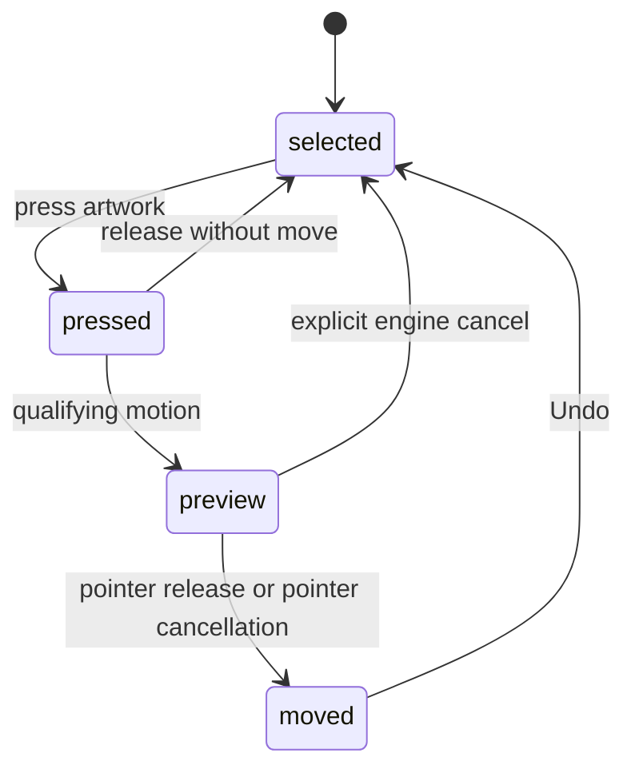

# Moving and drag duplication

## Summary

Dragging selected artwork changes its position. Several selected objects move
together. Holding Alt/Option at the initial press makes the drag work on a copy.
An ordinary completed move is one document undo step.

## The simple case

Select a shape, press its body, and drag it to a new position. Its visible frame
follows the preview. Release to keep the move, then Undo once to restore the
starting position.

With several objects selected, start on one of the selected targets to move the
set. To copy while moving, hold Alt/Option before pressing and drag the duplicate.

## The interaction, event by event

### Press

The target resolves through group selection rules. Pressing already-selected
artwork can capture the whole selected set. Pressing a different object targets
that object instead. Alt/Option duplication is captured from this initial event.

The session finishes incompatible editing and establishes a history boundary.
Selected-object paths can prepare that session before visible movement, including
preparing the duplicate. A press that ends without movement reverts that work.

### Release without dragging

No-movement endings revert the prepared move/duplicate session. A mere Alt-click
is not meant to leave a durable extra object. The original selection state at
the history boundary is restored by the explicit revert path.

### Begin dragging

The ordinary movement policy is three screen pixels, but selected-object
preparation can bypass the subsequent distance check. See the suspected
small-motion inconsistency under Edge cases rather than promising a universal
three-pixel dead zone.

### While dragging

The move preview follows pointer deltas converted through the current zoom.
Hover feedback is suppressed while the move owns the canvas. The captured object
set is stable for the session; moving a group does not independently drag each
descendant through unrelated gestures.

Alt pressed after the gesture began does not turn it into a duplication session.
Releasing Alt after an Alt-start does not select a different duplicate policy.

### Release

A changed session commits the move and one history step. An explicit engine
cancel clears the preview and restores the history mark. Browser pointer
cancellation uses the normal ending listener, so a move that already happened
is kept. That distinction is a suspected cancellation-policy defect.

## Modifiers

| Modifier | Set at the start | Changed while dragging |
| --- | --- | --- |
| Shift | Can change selection routing before move starts. | The inspected move loop does not apply axis locking. |
| Alt/Option | Duplicates for this drag. | Latched from press; later changes do not change duplicate policy. |
| Ctrl/Cmd | Does not define an alternate move mode here. | History shortcuts can act during the session; verify the resulting session lifecycle. |
| Space | Routes a new press toward pan. | Does not provide a proven rollback of an existing move. |

## Cancel and interrupt

| Event | Before dragging | While dragging |
| --- | --- | --- |
| Escape | Pointer may clear selection or exit group focus. | Move listener has no Escape cancellation; result after selection changes needs verification. |
| Switching tools | Changes next gesture routing. | Existing window move listener is not directly removed by this handler; verify continuation. |
| Menu opening or undo/redo | May finish editing or change history. | Undo clears active history marks; possible preview/session interaction needs verification. |
| Window loses focus | Clears Space and Pen modifiers. | No blur rollback in this move listener; outside-release recovery needs verification. |
| Pointer leaves the window | No move yet to commit. | Window listeners continue while events arrive; release outside browser needs verification. |
| Reload or tab close | Ends the page session. | Transient preview is not itself a committed move; actual persisted state depends on workspace timing. |
| Target changed or deleted | Current ids resolve at session start. | Changes to captured targets need verification; do not promise conflict resolution. |
| Touch cancel or second input device | No movement ending reverts prepared session. | `pointercancel` after movement commits through the ordinary ending path; second-device identity handling needs verification. |

## Interactions with other systems

Containers and groups move as selected roots. Selection stays on the moved set
or its duplicate. Locked/hidden eligibility is a separate entry-path question.
History groups duplication and movement into one action. Zoom converts screen
movement into document distances. Offline movement has no network step in this
path. Touch and stylus inherit no verified cancellation promise. Collaboration
and concurrent editing of the same target remain outside tested behavior.

## Edge cases

- Preparing a selected-object move on an animation frame makes `dragSession`
  truthy. The movement gate accepts that session without checking three pixels,
  so tiny pointer motion can move a selected object. This may be worth treating
  as a bug rather than documenting as intentional; see local triage.
- Browser cancellation commits moved content while an explicit engine cancel
  restores it. Reproduce with a real interruption before choosing the UX policy.
- No-movement, move-then-return, and duplicate-then-return are different cases:
  the last can still contain a real newly created object.

## Open questions and verification

- Verify tiny motion after a brief held press and compare with an unselected
  target; verify browser cancellation, Escape, and undo during movement.
- Evidence: `transform/selection-drag.ts`, canvas node drag listeners, single and
  multi-selection move overlays, move/history/container-drag contract tests.

Source reviewed against PunchPress commit `d4e6d4a`. Status: drafted.
