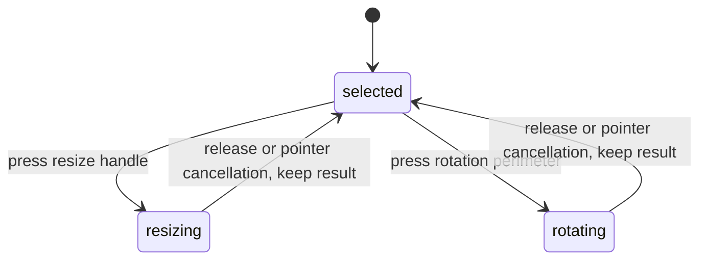

# Resizing and rotating

## Summary

Selection handles resize artwork. Dragging the corner perimeter rotates eligible
artwork. A group or multi-selection transforms together. Frames resize their
production bounds and do not expose rotation.

## The simple case

Select a shape and drag a corner outward. The opposite corner remains the
anchor. Release to keep the new dimensions. Undo once restores the previous size.

For rotation, drag the corner perimeter around the selection center. The artwork
and rotation cursor follow the angle. Release to keep the rotation.

## The interaction, event by event

### Press

Only the left mouse button starts these overlay gestures. Resize captures the
opposite anchor and starting geometry. Rotation captures the selection center
and initial pointer angle. Invalid or unavailable sessions do not begin.

The resize path depends on the object: box-like nodes can change width and
height independently, while group/multi-selection resizing uses a common scale.

### Release without dragging

The ending path commits its session, but unchanged document content does not
create an undo change. The selection remains available for another transform.
Exact no-motion behavior still needs a browser check at each handle type.

### Begin dragging

These overlay handlers respond to pointer movement after the press; they do not
share the node-body move threshold. The active handle/cursor and suppressed hover
feedback indicate that the transform owns the gesture.

### While dragging

Single box resize can read Shift live to preserve the aspect ratio. Group and
multi-selection resize use uniform scale from distance to the anchor. Their
loop does not define a separate Shift mode.

Rotating accumulates angle changes around the center, avoiding a jump when the
pointer angle crosses its wrap boundary. No Shift angle snapping is applied by
the inspected overlay loop.

Rotated objects retain the intended opposite resize anchor. Containers preview
as a whole; descendants receive their durable updates at commit rather than each
being treated as an independent user gesture.

### Release

The current resize or rotation is committed as one history action. Cursor and
hover state return to their ordinary state. The same listener handles browser
pointer cancellation, so the partial result is retained on `pointercancel`.

## Modifiers

| Modifier | Set at the start | Changed while dragging |
| --- | --- | --- |
| Shift | For single box resize, ratio is read from movement events. | Toggles ratio preservation in that path; no rotation snapping or separate multi-selection mode in the inspected loops. |
| Alt/Option | No center-resize or transform duplication mode defined here. | No alternate transform applied by these loops. |
| Ctrl/Cmd | No alternate handle transform defined here. | History commands can still be dispatched; their mid-transform outcome needs verification. |
| Space | Pan routing may prevent ordinary handle interaction; verify overlapping hit targets. | Does not install transform rollback; interaction with pan needs verification. |

## Cancel and interrupt

| Event | Before dragging | While dragging |
| --- | --- | --- |
| Escape | Can change selection or tool according to context. | No Escape rollback in these handle listeners; verify what remains on release. |
| Switching tools | Changes available editing chrome. | Handler cleanup and continuation after chrome disappears need verification. |
| Menu opening or undo/redo | History/navigation acts on current state. | Undo can invalidate the active mark; preview and commit result need verification. |
| Window loses focus | Clears transient modifiers. | No explicit blur rollback here; held-pointer recovery needs verification. |
| Pointer leaves the window | No transform without movement. | Window-level listeners receive available events; release outside browser needs verification. |
| Reload or tab close | Ends page session. | Transient versus committed content depends on transform path and persistence timing. |
| Target changed or deleted | Missing geometry prevents session creation. | Captured geometry plus concurrent target changes need verification. |
| Touch cancel or second input device | Unchanged content produces no history change. | Pointer cancellation commits the current transform; multi-device isolation needs verification. |

## Interactions with other systems

Containers and groups share one transform gesture while preserving editable
descendants. Selection and locked/hidden object eligibility determine available
handles; do not infer command permissions solely from visible handles. History
records one changed gesture. Zoom leaves handles screen-sized and affects the
pointer-to-document conversion. Offline transforms use local state. Touch and
stylus cancellation are unverified through hardware. Collaboration is not a
supported conflict-resolution claim in this description.

## Edge cases

- Frame dimensions are kept at least one document unit in the inspected bounds
  resize path; dragging through the opposite edge does not invert the Frame.
- Multi-selection and box resize have different ratio behavior. Do not promise
  Shift changes every resize or snaps rotation to a fixed angle.
- `pointercancel` retaining a partial transform is a supported suspected
  inconsistency with rollback expectations, shared with object movement.

## Open questions and verification

- Confirm cancellation on hardware and decide whether to retain or restore the
  partial result. Verify Escape/Undo while held and resize at extreme zoom.
- Evidence: single/multi-selection foreground handlers, resize/rotate engine
  sessions, resize-selection, rotate-selection and container-resize tests.

Source reviewed against PunchPress commit `d4e6d4a`. Status: drafted.
