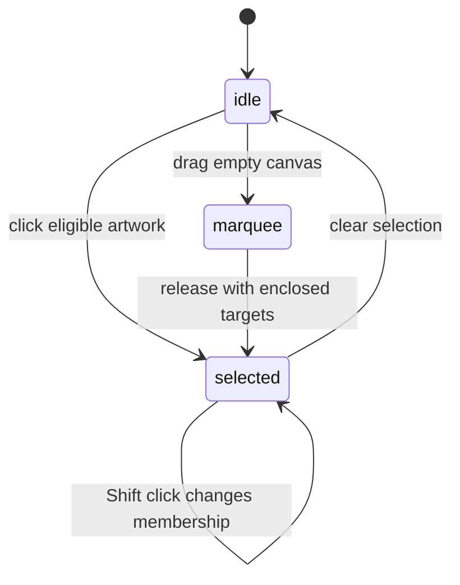

# Selecting artwork

## Summary

Pointer chooses whole objects for editing. Click visible artwork to select its
eligible object, use Shift to toggle membership, or drag a marquee across empty
canvas to select enclosed objects. Node's direct editing is a separate scope.

## The simple case

Press V and click a shape. Its selection frame and properties appear. Click
another unselected object to replace the selection. Press Escape to clear it.

To select several objects, Shift-click each one or enclose them with a marquee.
Ordinary marquee selection requires full enclosure rather than mere overlap.

## The interaction, event by event

### Press

Visible artwork, stacking order, group focus, and tool scope determine the
target. A normal group is selected as an outer object until group focus allows
its descendants. An unmodified press on already-selected artwork preserves the
other selected objects so they can move together.

Pressing empty canvas clears ordinary selection. Frame-body press handling is
special: it can defer selection until release, distinguishing a click from
movement. Do not treat all visible blank regions as identical event targets.

### Release without dragging

The clicked target remains selected, or Shift toggles its membership. Selection
alone does not add a document undo step. Choosing another object can finalize
an active text edit, so the whole action may also finish a document change.

### Begin dragging

Empty-canvas dragging can begin a marquee. Dragging artwork instead enters
[moving](moving.md). Object marquee does not begin while Space pan, inline text
editing, or path editing owns the interaction, or from blocked UI targets.

### While dragging

The marquee shows the region being considered. Pointer targets whole eligible
nodes; Node has separate candidate handling. Path-point marquees belong to the
path editing description, not this object selection gesture.

### Release

Enclosed targets become the selection. Shift at the selection-ending event
combines them with the previous set. Duplicate ids are removed. Partial overlap
alone does not qualify an ordinary object.

## Modifiers

| Modifier | Set at the start | Changed while dragging |
| --- | --- | --- |
| Shift | Toggles clicked membership; requests additive marquee. | Marquee ending reads Shift; verify a release-time change through the browser. |
| Alt/Option | Can route an object drag to duplication; see moving. | No selection-specific alternate marquee defined in the inspected path. |
| Ctrl/Cmd | Modified letter shortcuts do not select Pointer. | No universal select-under behavior is provided. |
| Space | Suppresses object marquee and enables pan. | Mid-marquee transition needs verification; do not assume rollback. |

## Cancel and interrupt

| Event | Before dragging | While dragging |
| --- | --- | --- |
| Escape | Pointer exits group focus first, otherwise clears selection. | Key dispatch exists; marquee-library termination needs verification. |
| Switching tools | Changes the next selection/edit intent. | End handler rejects tools that cannot marquee; behavior between eligible tools needs verification. |
| Menu opening or undo/redo | Focus can suppress canvas shortcuts; history affects document content. | Selection may reference changed content; actual end result needs verification. |
| Window loses focus | Clears temporary modifiers. | Marquee end/cancel delivery needs verification. |
| Pointer leaves the window | No hover target outside the window. | Marquee is bounded to the host; outside release delivery needs verification. |
| Reload or tab close | Ends this editor session. | No gesture is resumed by these listeners after reload. Restored selection belongs to workspace loading. |
| Target changed or deleted | Targeting uses available objects. | Released ids are resolved through current selection rules; live deletion needs a browser check. |
| Touch cancel or second input device | Mouse pilot does not establish device equivalence. | Library cancellation and multi-input behavior need verification. |

## Interactions with other systems

Containers and groups govern click ownership. Exiting focus selects the group,
while selecting outside a focused group clears that focus.

Selection and locked/hidden objects use different canvas and layer entry points.
Hidden geometry is excluded from normal canvas hits; command eligibility must be
checked individually rather than inferred from visibility alone.

History excludes plain selection, but selecting away from text finalizes editing.
Zoom changes screen geometry without changing which document object is selected.
Offline selection uses local document state. Touch and stylus need device checks.
Collaboration-driven target changes are not established by this implementation.

## Edge cases

- Fully enclosed means the ordinary marquee's full-hit rule, not every visible
  contour point of arbitrary clipped artwork. Test irregular geometry separately.
- Node multi-selection does not automatically become single-path editing.
- Focused descendants and container selection should not be described as two
  independently editable copies of the same artwork.

## Open questions and verification

- Verify Shift changes at marquee release, outside-window release, and canceled
  marquees. No missing library handler alone is classified as a defect.
- Evidence: Pointer/Node tools, selection actions, selection-marquee browser
  callbacks, and selection/group-selection/interaction-modes tests.

Source reviewed against PunchPress commit `d4e6d4a`. Status: drafted.
