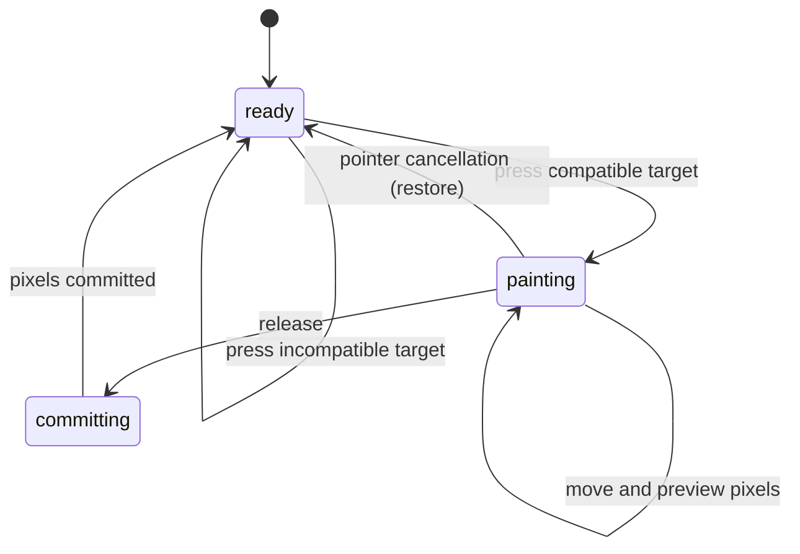

# The Brush and Eraser tools

## Summary

Brush adds colored pixels to a Raster layer; Eraser reduces their opacity.
Select Brush with B or Eraser with E outside focused inputs. A round footprint
shows the brush size over the canvas, and Properties exposes the active tool's
settings. These tools operate on raster content rather than drawing vector paths.

## The simple case

With nothing selected, choose Brush and draw on empty workspace. A Raster layer
appears and the stroke is visible while the pointer is held. Release to keep it.
Further strokes on empty workspace use the selected Raster layer.

Choose Eraser and draw across that paint. The underlying workspace shows through.
Undo restores the last completed stroke. Brush and Eraser stay active after
release and remember their own settings when switching between B and E.

## The interaction, event by event

### Press

A directly hit Raster layer wins over the selection. Otherwise the hit surface
must be empty workspace, an empty layer, or a Frame. The single selected Raster
layer then wins, followed by a selected empty layer. Selected text, paths, shapes,
vectors, or groups block raster creation. Multiple selection does not provide a
single selected target.

With no compatible selected target, a stroke creates a Raster layer. A Frame
under the initial point becomes its parent. An empty layer becomes raster content
under the same name and identity. The target and settings are captured for the
stroke; moving across another image does not retarget it.

### Release without dragging

A click is a brush dab, not a selection-only action. The initial point is painted
and a completed dab can create a layer and a history step. A stroke with no dirty
pixels takes the history-revert path instead of retaining a materialized target.

### Begin dragging

Painting starts from the initial point. Brush does not wait for the object-move
threshold. Pixel loading may finish after the press; sampled points are queued
until the working image is ready. Fast press-and-release must still retain a dab.

The durable layer dimensions are not rewritten on each pointer move. The live
painting surface can extend beyond that rectangle until the stroke commits.

### While dragging

Brush joins sampled positions using the captured size, opacity, hardness, color,
and spacing. Hardness softens the circular edge; lower hardness also changes dab
coverage. Eraser uses the same footprint but removes opacity instead of adding
color. Repeated translucent strokes accumulate.

Unclipped paint may expand a Raster layer in any direction while keeping old
pixels in the same workspace position. Eraser stays within the existing raster
plane. For an axis-aligned directly Frame-parented raster, clipping prevents
painting outside the production area from expanding invisible pixel storage.
Rotated rasters use a raster-local bounding rectangle of the Frame; strict
pixel-storage clipping to the transformed Frame outline remains an open check.

### Release

Release includes the final pointer point and commits one stroke history step.
A changed raster is stored as lossless PNG content, including transparency.
Large tiled strokes can finish encoding after release; their working pixels stay
visible until committed pixels have rendered. Starting another stroke must not
make the previous completed stroke disappear.

Undoing the first stroke on an empty layer restores the empty layer. Fully erasing
an image leaves an empty Raster layer selected instead of deleting the layer.

## Modifiers

| Modifier | Set at the start | Changed while dragging |
| --- | --- | --- |
| Shift | No special brush mode. | No straight-line constraint in the stroke update. |
| Alt/Option | No alternate brush mode. | Does not turn paint into erase. |
| Ctrl/Cmd | No alternate brush mode. | History shortcuts are separate; mid-stroke Undo needs verification. |
| Space | Requests temporary pan for a new canvas press. | Does not cancel the existing stroke session; takeover needs verification. |

## Cancel and interrupt

| Event | Before dragging | While dragging |
| --- | --- | --- |
| Escape | Selects Pointer from idle Brush/Eraser. | Changes tool; no Brush deactivation cancellation is defined. Verify whether the existing stroke continues. |
| Switching tools | Selects the next tool. | The placement listener remains responsible for ending the stroke; verify held-pointer switch. |
| Menu opening or undo/redo | Changes document history or opens UI. | Undo can invalidate a stroke history mark; verify pixel and layer recovery. |
| Window loses focus | Clears temporary Space mode. | No stroke-specific blur cancellation is installed; verify outside release. |
| Pointer leaves the window | No stroke until press. | Captured pointer events can continue; release outside the browser requires observation. |
| Reload or tab close | Ends this page session. | Uncommitted working pixels are not saved assets; persistence timing belongs to workspace documents. |
| Target changed or deleted | Resolves target at press. | Stroke retains its target id; deletion or replacement during asynchronous completion needs verification. |
| Touch cancel or second input device | Pointer cancellation after press restores its history mark. | Pointer cancellation invokes stroke cancel and restores the starting state; second-device filtering needs verification. |

## Interactions with other systems

**Containers and groups.** Direct Frame parenting clips paint. Nested-group clipping is not established by this direct-parent check. See [groups](../workspace/groups.md).

**Selection and locked/hidden objects.** Target choice follows the rules above, rather than selection alone. Hidden and locked target reachability needs browser verification; the raster resolver itself does not add a lock check.

**History.** One completed stroke is one undo step. Tool option changes are session preferences and do not paint pixels.

**Zoom.** The footprint follows zoom. Large strokes at very low zoom use a tiled surface; pixel position should stay stable when panning or zooming afterward.

**Offline.** Painting existing local raster content has no remote service step. Initial app loading and externally supplied image availability are separate.

**Touch and stylus.** Pressure, tilt, and pen-button adjustments are not inputs to the reviewed stroke sampler. Physical cancellation and multi-device takeover remain unverified.

**Collaboration.** There is no described shared raster-edit session or concurrent-writer conflict policy.

## Edge cases

- Brush starts at size 24, opacity 100%, hardness 100%, spacing 0, and dark color `#111111`.
- Size normalizes to 1–500; opacity and hardness to 0–100%; spacing to 0–200%. Invalid numeric input keeps the previous value.
- Brush and Eraser remember separate size, opacity, hardness, and spacing. Eraser ignores color.
- Existing unclipped image planes retain their geometry on ordinary commits; expanding strokes increase logical bounds without shifting earlier paint.
- A directly hit non-raster object blocks the stroke even when a compatible raster is selected behind it.

## Open questions and verification

- Source evidence: `tools/brush-tool.ts`, `brush-target.ts`, `brush-settings.ts`, and browser `canvas-tool-placement-session.ts`. Brush settings contract tests and raster-brush E2E assertions describe the intended results; this drafting pass did not run browser cases.
- Verify Escape, tool switching, Undo during a stroke, decode failure, pending tiled commits, and pointer cancellation on hardware. These are open checks, not confirmed defects.
- Checklist: [Brush checks](../verification/text-raster.md#toolsbrush-and-erasermd).

Source reviewed against PunchPress commit `d4e6d4a`. Status: drafted.
