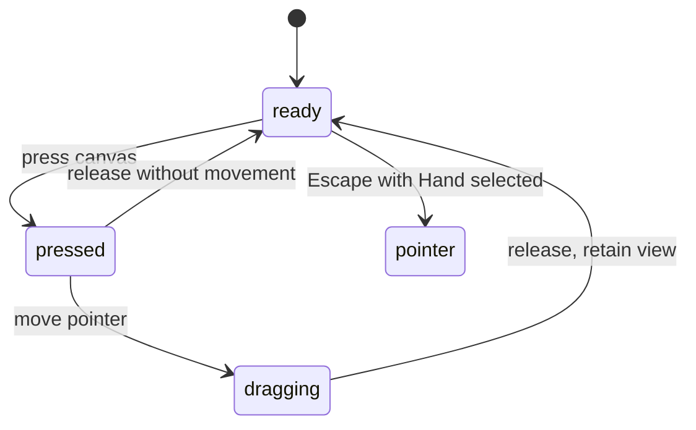

# The hand tool

## Summary

The Hand tool moves the viewport across the workspace. Select Hand in the bottom
toolbar or press H with editor focus outside inputs, menus, and dialogs. Artwork changes position
on screen as the view moves; panning does not edit the artwork.

Holding Space outside text inputs enables temporary pan from another tool.
The selected tool stays the same. This distinction matters when returning to
editing after a pan.

## The simple case

Start with a visible frame and select Hand. Press on the canvas, drag to the
right, and release. The frame moves to the right on screen. The toolbar's zoom
percentage stays the same, and the frame remains selected in Layers.

Hand stays selected after release. Drag again to continue navigating, or press
Escape to return to Pointer. The existing pan position remains after that idle
tool switch.

## The interaction, event by event

The diagram covers the ordinary mouse path. Mid-drag Escape, focus loss, and
device takeover remain open verification cases, not proven transitions.

### Press

With Hand selected, a canvas press begins navigation rather than starting the
selected object's editing gesture. The existing selection is preserved in the
observed frame-body case.

Space must already be held to request temporary pan for a new press. Space typed
into an input is excluded from the global temporary-pan shortcut.

The canvas uses a hand cursor when pan mode is enabled. A different cursor shape
specifically during dragging has not been confirmed.

### Release without dragging

A press and release with no movement should leave the view where it was. The
pan path has no document edit to commit and creates no undo entry. Hand remains
selected. The no-movement UI case still needs the checklist pass.

### Begin dragging

Pointer motion moves the viewport. PunchPress does not specify a separate
application-level drag-distance threshold for Hand; the exact small-motion and
device behavior still needs observation.

> Technical note: The browser canvas delegates mouse dragging to InfiniteViewer.
> Its `threshold={0}` setting is not sufficient evidence for a mouse movement
> threshold; library behavior must be checked before assigning a numeric claim.

### While dragging

The workspace moves through the viewport while the surrounding toolbar and
panels stay in place. The observed drag preserved the selected frame, its
4500-by-5400 size, and the displayed 21% zoom.

Panning does not create new content or change object geometry. A drag can move
the artwork partly out of view. Its exact speed, post-release motion, and
relationship to screen distance have not been measured.

### Release

The new viewing position remains. No document history step is added for the
pan. Hand remains selected until the user chooses another tool or presses Escape.

For temporary pan, releasing Space removes the temporary pan mode. Whether an
already-running mouse drag stops immediately on Space release needs a separate
check; removing pan mode and ending a gesture are not assumed equivalent.

## Modifiers

| Modifier | Set at the start | Changed while dragging |
| --- | --- | --- |
| Shift | No Hand-specific constraint is defined in the inspected app path; browser behavior unverified. | Axis locking or other dependency behavior needs verification. |
| Alt/Option | No Hand-specific alternate pan is defined; Alt+H does not select Hand. | No app-level alternate pan is defined; actual drag behavior needs verification. |
| Ctrl/Cmd | Ctrl/Cmd+H does not select Hand through the editor shortcut. Modified dragging needs verification. | Modified dragging needs verification. Ctrl/Cmd+wheel is a separate zoom action. |
| Space | Enables temporary pan outside inputs without selecting Hand. | Releasing clears temporary mode. Whether the current drag stops, and whether pressing Space can take over another drag, need verification. |

Modifier changes are read live for temporary pan. The lifecycle of an existing
gesture can still be owned by the browser interaction library.

## Cancel and interrupt

| Event | Before dragging | While dragging |
| --- | --- | --- |
| Escape | From idle Hand, selects Pointer. Behavior after press but before motion needs verification. | Hand's shortcut selects Pointer if it receives Escape; whether the running pan stops needs verification. No viewport rollback is defined by that shortcut. |
| Switching tools | A tool shortcut can replace Hand. Whether a pressed gesture survives needs verification. | Tool selection changes; continuation or termination of the drag needs verification. |
| Menu opening or undo/redo | Undo/redo applies to document history, not pan. Menu behavior needs verification. | Undo/redo still has a document shortcut path. Whether it or a menu interrupts navigation needs verification. |
| Window loses focus | Clears temporary Space mode; does not explicitly change selected Hand. Pressed-state cleanup needs verification. | Clears temporary Space mode. Whether the library ends a Hand drag needs verification. |
| Pointer leaves the window | Behavior while pressed needs verification. | Continuation outside the browser and release outside the window need verification. |
| Reload or tab close | Ends this page session. View restoration is outside this pilot. | Ends this page session. Restored pan position and persistence timing are unverified. |
| Target changed or deleted | The viewport is the navigation target. Deleting an object does not delete the viewport. | Behavior when selection changes or an object is deleted during a pan needs verification. |
| Touch cancel or second input device | Not established for this mouse/keyboard pilot. | Not established; test touch cancellation and pinch takeover on appropriate hardware. |

After Escape from idle Hand, Pointer is selected and the panned view stays in
place. Do not apply this observed result to all interruption rows.

## Interactions with other systems

Containers and groups remain artwork in the moving view. Panning does not
reparent them. Group-specific hit targets have not been checked in the browser.

Selection and locked/hidden objects retain their document state during pan.
The first pass confirmed selection retention for one visible frame. Locked
objects, hidden objects, and selected transform handles need separate checks.

History excludes pan and zoom. Undo should reach the preceding document edit,
not reverse a navigation gesture. This follows source review and the existing
history contract; it has not yet been checked through this pilot's UI sequence.

Zoom remains unchanged during the observed ordinary Hand drag. Wheel zoom is a
separate input path; its behavior during an active drag remains unverified.

Offline navigation has no network request in the inspected pan path. Loading
the app offline and asset availability are separate concerns outside this pilot.

Touch and stylus have not been verified. Do not extrapolate the mouse results to
pinch gestures, pen buttons, or device cancellation.

Collaboration behavior is not established by this pilot. No claim is made about
another user's view or edits affecting a pan.

## Edge cases

- H is a tool shortcut with editor focus outside inputs, menus, and dialogs;
  modified H shortcuts are not claimed.
- Holding Space while editing text must not swallow ordinary spaces. Check both
  inline text and properties inputs before treating this as fully verified.
- Empty-workspace navigation, locked objects, and handles may have different
  event targets and remain explicit verification cases.
- Toolbar labels still say "Add artboard" and "Artboard 1" while the properties
  panel says "Frame." The glossary uses Frame and steps quote the actual labels.

## Open questions and verification

- The first agent-driven browser pass confirmed H activation, a right/down drag,
  retained frame selection and displayed size/zoom, Hand remaining selected,
  and idle Escape returning to Pointer. It did not measure exact pan distance.
- Space-release, focus-loss, and mid-drag tool-switch behavior need observation
  of the dependency-owned gesture. Missing Hand handlers do not prove a defect.
- Cursor state, inertia, tiny movements, input-field exclusions, object-hit-target
  variants, and undo behavior need the remaining checks.
- No suspected defect with a supported cause has been established.

Source reviewed against PunchPress commit `d4e6d4a`. Browser results and limits
are recorded in [the checklist](../verification/hand-tool.md). Status: drafted.
