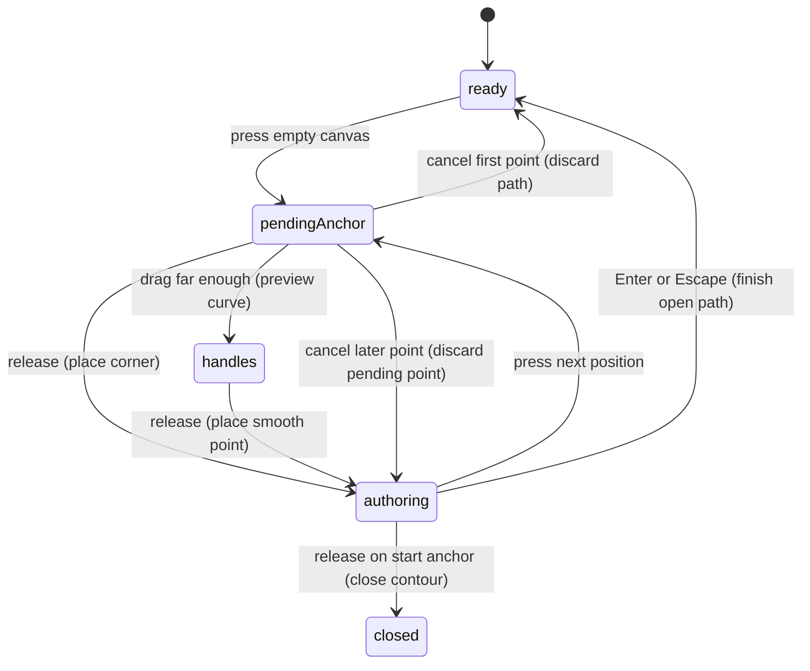

# The Pen tool

## Summary

Pen builds editable paths one anchor at a time. Press P or choose Pen, then click
for straight points or drag for curved points. Pen remains active between points
and shows a preview of the segment that the next press would create.

Pen also continues an existing open endpoint, inserts a point on an existing
segment, deletes an interior point, and changes an anchor between corner and
smooth. Hover feedback distinguishes these actions before the press.

## The simple case

Press P and click three different canvas positions. Each release adds a corner
anchor to the same open path. Move without pressing to see the pending segment.
Press Enter to finish. Pen remains active; the next disconnected click starts a
new path.

For a closed path, click the starting anchor instead of pressing Enter. The
contour closes and the closing anchor stays selected for point editing. Closing
does not select Pointer or flatten the path into an image.

## The interaction, event by event

### Press

An ordinary first press creates a pending open path and selects its first anchor.
Subsequent presses target the same contour while authoring continues. The path's
position is anchored to the workspace point beneath the pointer.

Without an active authoring session, Pen tests an existing editable target before
starting a disconnected path. Option on an anchor takes priority for point-type
conversion; an open endpoint requests continuation; an interior anchor requests
delete; a segment requests insertion. These intents are not interchangeable.

Selecting Pen while exactly one open endpoint is selected resumes that endpoint.
Continuing from the leading endpoint reverses the contour's traversal so the new
segment can extend from the selected end without moving the existing artwork.

### Release without dragging

A normal click places a corner with collapsed handles. A click on an interior
anchor deletes it only if the gesture stays below the Pen click/drag tolerance.
Moving beyond that tolerance suppresses the delete rather than turning it into
an anchor move.

Clicking a segment inserts at the hovered curve position. Clicking an open
endpoint starts continuation without appending a duplicate endpoint. Finishing
a one-point new path discards it rather than retaining an unusable object.

### Begin dragging

Dragging a pending anchor far enough authors incoming and outgoing handles.
The initial point and later points use the authored handle length to decide
whether the result is smooth; small movement can still produce a corner.

> Technical note: The handle threshold is named as 12 pixels, but
> `getPenDragHandle` receives workspace/canvas coordinates. The source therefore
> predicts a zoom-dependent screen threshold: 6 screen pixels at 50%, 12 at
> 100%, and 24 at 200%. This differs from the 3-screen-pixel delete-click guard.
> The zoom dependence is a suspected defect, pending observation.

Dragging a segment insertion authors handles on the inserted point in the same
gesture. Dragging at the closing anchor can close with a smooth incoming handle.

### While dragging

The anchor stays at the press position while its handles follow the drag.
Ordinary authored handles are mirrored around the anchor. The preview shows
how the next curve changes; the surrounding artwork is not moved with it.

Holding Space after the gesture starts moves the pending anchor by subsequent
pointer movement while preserving its current handles. Releasing Space resumes
handle authoring from the relocated anchor. This is distinct from starting a new
gesture with temporary pan already enabled.

Option-modified editing of an existing anchor belongs to its conversion gesture.
Cmd temporarily exposes direct point editing without selecting a different tool;
see [path editing](../editing/path-editing.md#modifiers).

### Release

A released point becomes a history step. Undo removes the most recently authored
point while preserving the ongoing Pen session where the remaining path is
valid; Redo restores it and the active endpoint. The whole path is not treated
as one indivisible undo action.

Enter or Escape finishes the active contour without selecting Pointer. A later
Escape with no authoring session selects Pointer. Closing also finishes the
authoring session, retaining path editing and selecting the closing anchor.

## Modifiers

| Modifier | Set at the start | Changed while dragging |
| --- | --- | --- |
| Shift | No angle constraint in ordinary new-point authoring; direct handle editing has its own constraint. | Ordinary placement ignores its aspect-ratio input; direct/Option handle gestures can constrain angle. |
| Alt/Option | Existing-anchor click toggles corner/smooth before continuation or delete is considered. | Existing handle edits can break coupling; ordinary new-point placement has no Alt variant. |
| Ctrl/Cmd | Cmd enables temporary direct point editing while Pen stays selected. Ctrl equivalence is not assumed. | Cmd handoff during a pending placement needs browser verification. |
| Space | Shared temporary pan can own a new press. | Repositions the pending anchor while preserving handles, then resumes handle authoring when released. |

## Cancel and interrupt

| Event | Before dragging | While dragging |
| --- | --- | --- |
| Escape | Finishes an active path; a one-point path is discarded. Idle Pen returns to Pointer. | Finishes the authoring session; pending placement listener cleanup and final release need verification. |
| Switching tools | Leaving Pen finishes valid authored content; active authoring suppresses ordinary letter tool shortcuts. | Toolbar change deactivates Pen and finishes its session; the placement listener is not explicitly canceled by this callback. |
| Menu opening or undo/redo | Undo/redo resynchronizes the active endpoint with surviving geometry. | History clears the draft and pending history mark; verify release after undo while holding the pointer. Menu ownership follows focus. |
| Window loses focus | Clears temporary modifiers; Pen is not explicitly deselected. | No placement-session blur listener is installed; release delivery and preserved preview need observation. |
| Pointer leaves the window | Leaving canvas clears idle/next-segment hover feedback when no draft is active. | Pointer placement uses capture and window listeners; release outside the browser still needs a physical check. |
| Reload or tab close | Ends authoring; restoration follows workspace persistence. | The in-progress gesture is not resumed by placement listeners after reload. Persistence of partially authored content needs checking. |
| Target changed or deleted | An invalid or closed authoring target clears the session on its next lookup. | Updates reject missing geometry; whether every overlay clears immediately needs observation. |
| Touch cancel or second input device | Pointer cancellation calls the placement cancel action. | First-point cancel discards the new path; later-point cancel reverts the pending point. Multiple-device ownership is unverified. |

## Interactions with other systems

Containers and groups do not make a new Pen path inherit arbitrary group focus.
The inspected new-path action starts at the workspace root. Continuation edits
the existing target in place, including eligible vector-owned path content.

Selection and locked/hidden objects govern what can be reached. Idle hover uses
the selected/editing target; Pen is not a universal delete-on-hover mode for
all artwork. Command-level lock enforcement needs a separate check.

History records released points and resynchronizes authoring after undo/redo.
A canceled draft does not intentionally erase the preceding released points.

Zoom affects projected handles and, in the inspected source, the effective
new-handle threshold described above. Existing-anchor hit tolerances use their
own targeting conversions; do not infer all Pen tolerances from one number.

Offline authoring uses document geometry and does not request a server.
Touch and stylus cancellation use the pointer path where delivered, but pressure,
pen buttons, and a second simultaneous device have not been verified.
Collaboration-driven concurrent point edits are not established by this surface.

## Edge cases

A path can finish open; closing is optional. Drawing disconnected contours
normally produces separate path objects. A resumed leading endpoint changes
traversal order internally, so canceling continuation must preserve the prior
visible curve even though its endpoint indices were temporarily reversed.

Pen does not interpret E as a path-edit command while authoring. Existing-path
insertion follows the exact hovered position along the segment, not its midpoint.
Nearby anchor halos take precedence over segment insertion.

## Open questions and verification

- Suspected defect: new-point smoothing uses a workspace-distance threshold and
  therefore changes sensitivity with zoom. Compare identical screen drags at
  50%, 100%, and 200% before deciding whether to fix or document this policy.
- Verify Escape/tool switching during a held placement, undo then release,
  focus loss, and Cmd handoff during a draft. These are lifecycle questions,
  not additional supported defects.
- Evidence: Pen tool/session/draft/existing-point modules, placement browser
  listeners, and `vector-pen-authoring` contract tests. Checklist:
  [Pen verification](../verification/vector.md#toolspenmd).

Source reviewed against PunchPress commit `d4e6d4a`. Status: drafted.
