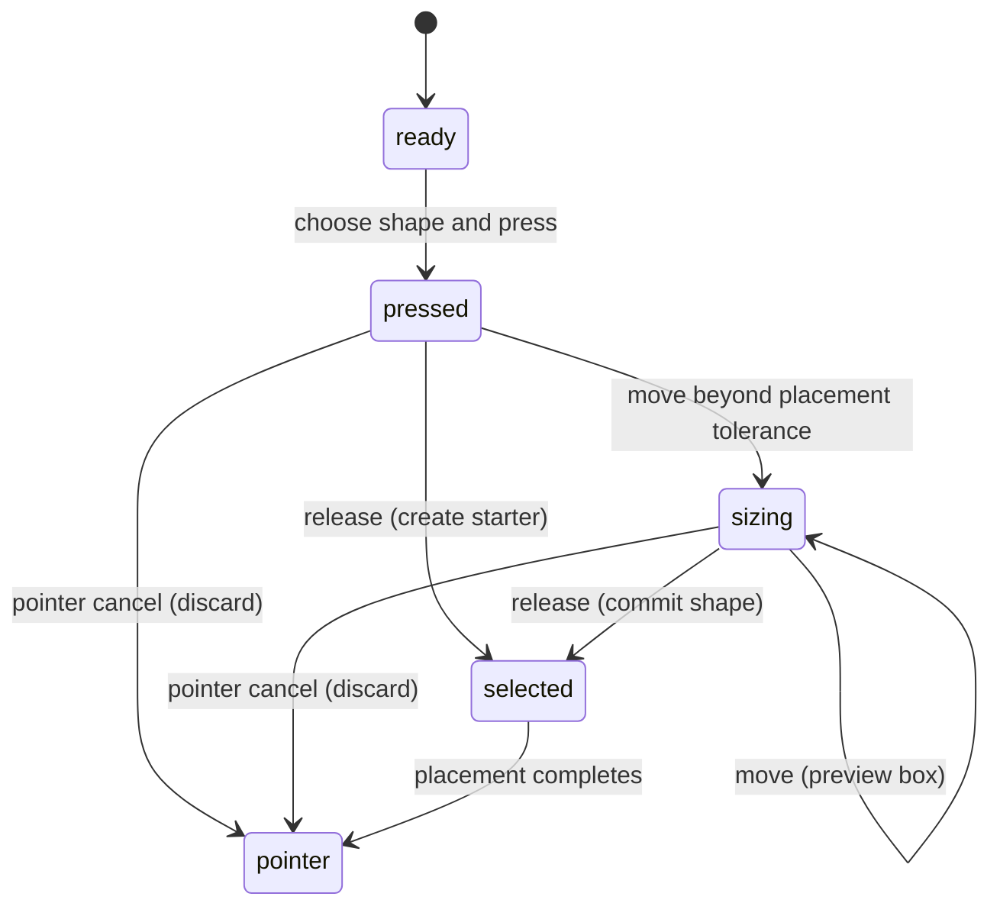

# The Shape tool

## Summary

Shape creates live polygons, ellipses, and stars. The rectangle starter is a
four-corner polygon. Press R, O, or S for the corresponding choice, or use the
shape toolbar. Click for a comfortable starter size; drag for a specific box.

Created shapes remain editable geometric objects. Width, height, fill, stroke,
and supported corner controls remain available until a point edit requires
freeform path geometry.

## The simple case

Press R, press on empty canvas, drag down and right, then release. A black
rectangle fills the placement box and becomes selected. Pointer becomes the
active tool, so the next body drag moves the finished shape.

Select the shape and change Width or Height in Properties. For an ellipse or
star starter, choose O or S before creating the next shape. Shape creation is
a single placement gesture, not a repeating stamp mode.

## The interaction, event by event

### Press

The selected shape family determines the object to create. A press over existing
artwork also requests placement at the corresponding canvas position; it is not
a request to edit the underlying object's geometry.

An existing editing session is finished before placement begins. The editor
opens a history step, but does not create a click-sized shape until release.
This prevents an unfinished click from immediately leaving a starter object.

### Release without dragging

Release below the placement threshold creates a centered starter shape. Its
size comes from the Frame under the click, or the visible workspace bounds
when the click is outside a Frame. It is not a fixed 240-pixel stamp.

The starter width is 20% of that reference width, rounded to tens with a minimum
of 10. Height is the rounded width multiplied by 0.64 for polygon, 0.74 for
ellipse, or 1 for star. A 4500-unit Frame therefore gives a 900-by-580 polygon,
900-by-670 ellipse, or 900-by-900 star.

The created shape is selected, and Pointer is activated. A first substantial
click-created object can trigger fit-to-view; drag-created shapes do not use
that click-only fitting branch.

### Begin dragging

At the [placement threshold](../foundations/input.md), the shape appears with
the actual drag box. The press position is one corner; moving left or upward
places the box on that side of the origin rather than producing negative size.

Each dimension is at least one document unit. The width and height shown after
placement are rounded to two decimal places. Ergonomic starter rounding does
not apply to a drag-created shape.

### While dragging

The opposite corner follows the pointer. Shift makes both dimensions equal to
the larger absolute axis distance, producing a square placement box. That means
a circle for ellipse and a proportionate square box for polygon or star.

Shift is read during movement and again at release. Releasing it before the
final release restores unconstrained dimensions for the last pointer position.
The live preview changes size without repeatedly creating replacement objects.

### Release

The latest box becomes the shape's durable geometry in one placement history
step. Undo removes the placed shape; Redo restores it. Selection remains on the
new shape and the tool returns to Pointer.

Frame parenting is chosen from the shape center when the node is first created.
For a drag this happens when movement first crosses the threshold. Moving the
preview across a Frame boundary later does not rerun that placement-parent
choice; test this distinction before treating release location as ownership.

## Modifiers

| Modifier | Set at the start | Changed while dragging |
| --- | --- | --- |
| Shift | Requests a square box once dragging begins; click starter sizing is unchanged. | Live constraint and release-time constraint use current Shift state. |
| Alt/Option | No center-out placement variant is defined. | No effect on the inspected shape sizing action. |
| Ctrl/Cmd | Modified letter shortcuts do not select a shape tool. | No effect on the inspected shape sizing action. |
| Space | Temporary pan can own the next canvas gesture. | Shape sizing does not consume Space as a reposition command; view takeover during placement needs verification. |

## Cancel and interrupt

| Event | Before dragging | While dragging |
| --- | --- | --- |
| Escape | Shape's key handler selects Pointer. A held press is not explicitly canceled by that handler. | Suspected inconsistency: switching to Pointer leaves the placement listener able to complete on release. |
| Switching tools | Changes the selected tool; the pressed placement retains its captured shape choice. | Placement listener is not tied to tool deactivation; release can still create the captured shape and select Pointer. |
| Menu opening or undo/redo | Menu focus owns relevant keys; document undo remains separate from selecting Shape. | Interleaving history commands with the open placement mark needs verification. |
| Window loses focus | Clears temporary modifiers. | The placement listener has no blur cancellation; outside release delivery needs checking. |
| Pointer leaves the window | Pointer capture/window listeners retain the pressed gesture where the browser delivers events. | Continued sizing and release outside the browser need physical verification. |
| Reload or tab close | Ends this placement session. | Preview is not resumed after reload; recovery of an already-created threshold object belongs to persistence. |
| Target changed or deleted | There is no created shape before click release or crossing the threshold. | Missing created-node geometry rejects further updates; final history/selection behavior needs verification. |
| Touch cancel or second input device | Pointer cancel invokes placement cancellation. | Cancellation removes the pending shape, clears preview, and selects Pointer; device mixing remains unverified. |

## Interactions with other systems

Containers and groups do not supply arbitrary focused-group placement ownership.
A containing Frame can become the parent according to the initial center rule.
Grouping or moving the finished shape follows the ordinary object commands.

Selection and locked/hidden objects: the new shape is selected and visible.
Creation over an existing object's body does not itself change that object's
fill or geometry. Locked-target hit routing still needs a browser check.

History groups the completed placement and reverts explicit placement cancel.
Escape's tool change is different from invoking that cancellation action.

Zoom changes how document dimensions appear. Starter sizing uses Frame/world
bounds; drag sizing converts pointer positions to document coordinates.

Offline shape creation uses local geometry. Touch and stylus pressure do not
participate in the inspected box-sizing calculation; device delivery is untested.
Collaboration-created changes during placement are not established.

## Edge cases

Properties currently includes Poly, Oval, and Star choices that change the
selected shape family and the next creation choice. The setter clears individual
corner radii and clamps the shared radius when the new family supports it.
This contradicts the older product doc's statement that live shapes never switch
families; the description here follows the reachable source behavior.

Node editing can preserve a polygon when moving, inserting, or deleting straight
anchors, provided at least three valid points remain. A triangle cannot lose one
point through that live-polygon path. Moving star points can keep a star; inserting
or deleting star points converts to freeform geometry. Ellipse point edits and
smooth-handle semantics also convert. Explicit Convert to path preserves rendered
geometry, including rounded corners. See [path editing](../editing/path-editing.md).

Polygon and star corners can stay live. A shared radius clamps to a stable
geometric maximum, while selected-corner behavior has distinct controls. There
is no general star-point-count field in the inspected Shape properties panel.

## Open questions and verification

- Suspected defect: Escape selects Pointer during placement but does not cancel
  the active placement session; release can still commit the shape. Compare with
  pointer cancellation, which explicitly rolls back.
- Verify Frame-boundary crossing, family switching after custom point edits,
  selected-corner property scope, and focus-loss/reload behavior.
- Evidence: shape tool/model/engine, placement and ergonomic starter modules,
  property descriptor/fields, shape-path-edit and shape-point-topology tests.
  [Shape checklist](../verification/vector.md#toolsshapemd).

Source reviewed against PunchPress commit `d4e6d4a`. Status: drafted.
