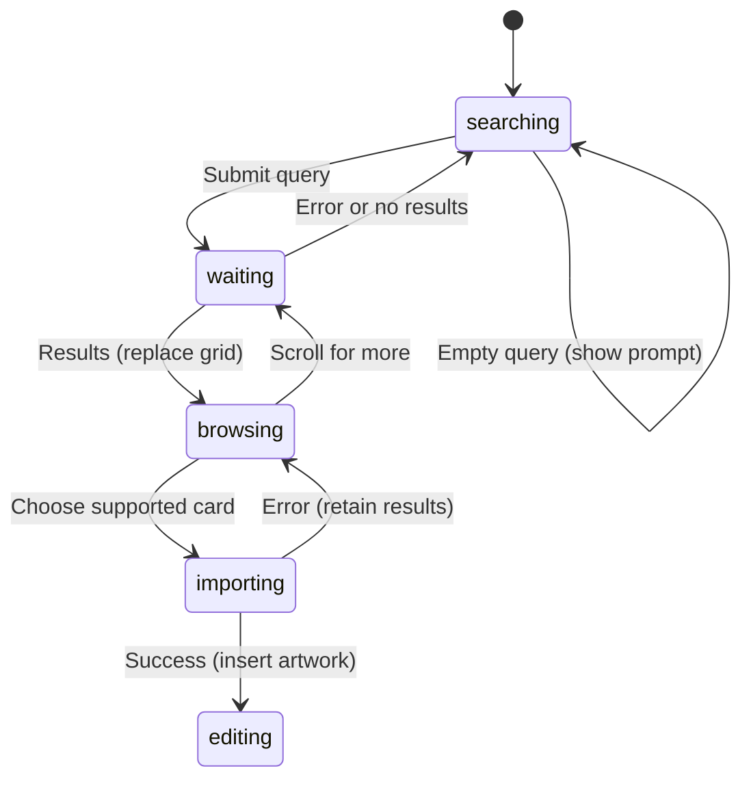

# Asset search

## Summary

Assets is a page inside the command menu for finding external artwork and adding
it to the canvas. Open the command menu with Cmd/Ctrl+K, choose Assets, enter a
query, and submit Search. Results show previews with the preferred import format.

Search and downloading require the configured asset service. Existing artwork
can still be edited when that service is unavailable; the search page reports
configuration or request failure separately.

## The simple case

Search for a term. The page shows a result grid. Click a supported result. Its
card shows an import spinner while the artwork downloads and is converted.
On success it is inserted at the editor viewport center, a success toast names
the asset, and the command menu closes.

An SVG result becomes editable grouped Paths through the ordinary SVG importer.
A PNG/JPG result becomes a Raster layer. If several formats exist, SVG wins,
then PNG, then JPG; there is no per-result format chooser.

## The interaction, event by event

The five phases map to opening/submitting search, an empty or canceled request,
waiting for results, browsing/downloading, and inserting an asset.

### Press: open and submit

Assets opens with a focused Search assets field. Typing alone changes the field;
the form submit or Search button starts a first-page request. Leading and
trailing whitespace is removed from the submitted term.

The request asks for SVG-, PNG-, and JPG-capable results, with 48 requested per
page. The returned service metadata determines current/last page. A result's
title is used in feedback, falling back to Asset # followed by its identifier.

### Release without dragging: empty query or unsupported card

Submitting an empty term clears results, resets pagination, and shows “Enter a
search term.” A result without a supported format is disabled, with Unsupported
asset as its action title. Merely inspecting its preview does not add artwork.

Closing the command menu before choosing a result creates no document edit.
Cancellation after a request or import starts has different limits below.

### Begin dragging: search and first results

While waiting, Search is disabled and shows loading feedback. If the grid is
empty, a Searching assets empty-state view appears. A successful first-page
response replaces the previous results. An empty first page shows No results.

A failed first-page search clears the grid and displays the failure message.
An unconfigured service reports “Asset search is not configured.” Other HTTP
errors include the response status. There is no automatic retry loop here.

### While dragging: pagination and download

Scrolling to within 360 pixels of the result viewport's bottom requests the
next page, provided loading is idle and more pages exist. New results append,
excluding identifiers already in the grid. The footer shows Loading more or
Scroll for more according to pending work and remaining pages.

Clicking a card chooses its preferred format and starts downloading. That card
is disabled while its tracked import is active. Other cards remain enabled;
there is no global import queue or cancel button. An import failure produces a
high-priority error toast and retains the result grid.

The raster provider response must contain image data and the command callback
also requires a MIME type. SVG responses must contain SVG text. The normal
SVG converter determines supported artwork fidelity, as described in
[Import](../documents/import.md#while-dragging-parse-and-normalize).

### Release: insert and return to editing

The insertion callback reads the viewport center when provider content reaches
it. SVG import groups supported Paths; raster import preserves aspect ratio
and caps the longest placed side at 720 document units. Insertion selects the
new root objects and is a document edit.

Success shows Added followed by the asset title and closes the menu. Search
results themselves do not become document content until insertion. There is no
saved asset-search history in this component's local state.

## Modifiers

| Modifier | Set at the start | Changed while dragging |
| --- | --- | --- |
| Shift | Normal text selection in the search field; no alternate search filter. | No app-defined multi-card selection or alternate importer. |
| Alt/Option | No asset-specific format or placement variant. | Card/browser modified-click behavior needs verification. |
| Ctrl/Cmd | K toggles the command menu. | Closing via K has no request-abort hook; late completion needs verification. |
| Space | Search input accepts spaces as query text. | Space outside inputs has the shared popup/pan question; it does not select a download format. |

Formats are chosen from service metadata, not modifier state. No held key
turns an SVG result into a PNG request.

## Cancel and interrupt

| Event | Before dragging | While dragging |
| --- | --- | --- |
| Escape | Menu dismissal before submission adds nothing. | Requests have no abort signal; closing during import may still permit insertion and needs verification. |
| Switching tools | Current editor tool does not choose search format. | No tool cancellation of requests; verify selected tool after insertion. |
| Menu opening or undo/redo | Assets is already a command-menu view with focused input. | Clipboard/editor shortcuts follow focus; Undo before delayed insertion can affect prior content. |
| Window loses focus | Query text stays component state while mounted. | Fetch/import has no blur cancellation; request failure reports normally. |
| Pointer leaves the window | No asset is added merely by leaving a card. | Provider work continues independently of pointer location. |
| Reload or tab close | Search state is not persisted. | No pending-request recovery; editor-tab changes during imports require a destination check. |
| Target changed or deleted | Import adds artwork rather than replacing selection. | Placement reads the callback editor's current view; active-tab/captured-editor races need checking. |
| Touch cancel or second input device | Search, scrolling, and card activation need device checks. | No special request rollback for touch cancellation. |

After a failure the user can submit again. Closing the visual menu should not
be assumed to cancel already accepted work without testing late responses.

## Interactions with other systems

**Containers and groups.** SVG results use Imported SVG groups. Imported artwork
does not replace the existing document's groups or Frames.

**Selection and locked/hidden objects.** Successful insertion selects its roots.
An existing locked/hidden object is not the download's replacement target.

**History.** Search and pagination create no artwork undo entries. Insertion
uses the same document action as local imported content.

**Zoom.** Viewport center determines placement. Raster placed size is in
document units, not a promise of the preview card's screen size.

**Offline.** Search and download use the PunchPress assets API. Offline service
failure does not provide cached result recovery in this component.

**Touch and stylus.** Infinite scroll and card activation require separate
physical-device verification; no drag-from-results feature is defined here.

**Collaboration.** Imported artwork becomes local document content. Search
results and requests are not shared between editors or devices.

## Edge cases

- Suspected mixed-query pagination: search A, type B without submitting, then
  scroll for more. Pagination uses the current field text with A's page number
  and existing grid, so results for B can append to A.
- Search is disabled through its button while loading, but form submission and
  overlapping requests have no response-version guard. Verify stale responses.
- Only one importing card identifier is tracked. Concurrent card clicks may
  make a previous card appear idle before its download completes.
- Missing raster MIME data can cause the insertion callback to return without
  inserting even though the panel reports Added. Provider-shape verification
  is required before treating this as a demonstrated service defect.

## Open questions and verification

Verify service configuration failure, pagination query changes, late responses,
concurrent imports, menu cancellation, and destination tabs. No external service
was contacted in this source-only pass.

Evidence: `asset-search-panel.tsx`, `magnific-assets.ts`, command-menu insertion,
and shared SVG/image import modules. See
[the checklist](../verification/documents.md#assets).

Source reviewed against PunchPress commit `d4e6d4a`. Status: drafted.
