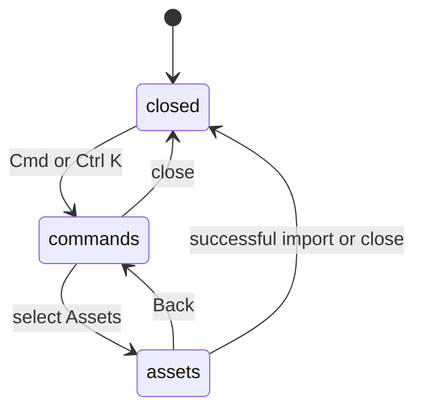

# Commands and settings

## Summary

Cmd/Ctrl+K opens the command menu. In this build its command list contains Assets
when asset search is available, rather than every editor command. The main menu
also exposes Settings, with Appearance and Debug sections.

## The simple case

Open the command menu, search for Assets, and open its search page. Back returns
to command rows. Closing normally resets the query and page. Open Settings to
inspect the current theme or refresh an editor debug dump.

## The interaction, event by event

The five phases below refer to opening, leaving unchanged, starting a command
or preference, editing/pending work, and closing rather than a physical drag.

### Press

Cmd/Ctrl+K toggles the command dialog. This listener does not apply ordinary
input/menu focus exclusions. Asset availability depends on development mode or
the desktop capability, so a production browser may show no action rows.

### Release without dragging

Opening and closing without running a command does not edit artwork. The command
search filters labels, values, and keywords without submitting a network search.

### Begin dragging

Selecting Assets changes to its visual search page. Selecting a theme in Settings
applies Light, Dark, or System immediately, without an Apply step. Debug captures
a snapshot when opened; it is not a continuously updating live dump.

### While dragging

Command search displays matching rows or “No results found.” Asset requests are
owned by [Assets](assets.md). Appearance stores the preference locally. System
follows changes in the operating system's color scheme.

Refresh dump reads current editor state. Copy dump refreshes first, writes to
the clipboard, then shows “Copied” briefly. Failure displays a clipboard-access
message and leaves the dump available to copy manually.

### Release

Normal dialog close resets command page/query. Closing Settings resets its next
opening to Appearance. Theme changes remain applied; closing is not cancellation
of those preferences. A second Cmd/Ctrl+K toggles open directly, bypassing the
normal reset callback; reopening can retain the previous page/query. This
inconsistency needs verification.

## Modifiers

| Modifier | Set at the start | Changed while dragging |
| --- | --- | --- |
| Shift | Cmd/Ctrl+Shift+K still matches the inspected K handler. | No separate menu mode. |
| Alt/Option | Cmd/Ctrl+Alt+K also matches this handler. | No separate menu mode. |
| Ctrl/Cmd | K toggles the menu. | Toggling again may preserve page/query unlike normal close. |
| Space | Text input in search; not a pan request there. | Other focused popup targets require the shared Space check. |

## Cancel and interrupt

| Event | Before dragging | While dragging |
| --- | --- | --- |
| Escape | Normal dialog dismissal closes without artwork edits. | Closing does not roll back applied preferences or completed asset imports. |
| Switching tools | Ordinary focused dialog shortcuts are suppressed. | Asset/tool interactions need verification after focus moves. |
| Menu opening or undo/redo | K can toggle even from other focus contexts. | Nested dialog/history shortcut behavior needs verification. |
| Window loses focus | Does not itself reset dialog state. | Clipboard result can arrive later; theme choice remains applied. |
| Pointer leaves the window | No command from hover alone. | Pending asset/clipboard work has its own completion behavior. |
| Reload or tab close | Dialog state is local to the page. | Stored theme survives; pending work is not resumed by this component. |
| Target changed or deleted | Commands bind to the active editor. | Asset insertion/tab switching needs the document/asset checks. |
| Touch cancel or second input device | Standard dialog controls; no device-specific claim. | Pending requests do not become document gesture rollback. |

## Interactions with other systems

Containers and groups are unaffected by opening the menu. Selection and hidden
objects can be inspected in Debug. History excludes theme/menu state. Zoom does
not scale the dialogs. Offline theme/debug work is local; Assets needs service
access. Touch and stylus accessibility need testing. Theme is not a collaboration
preference and no cross-device sync is established here.

## Edge cases

- The generic command-menu presentation does not imply Save, Undo, or all tools
  are searchable commands in this build.
- Theme defaults to System if stored preference is absent or invalid.
- A debug dump is potentially detailed document state; Copy does not upload it.

## Open questions and verification

- Verify K-close versus Escape-close reset and menu availability in production.
- Evidence: command-menu, Settings dialogs, theme provider, debug-copy handlers.

Source reviewed against PunchPress commit `d4e6d4a`. Status: drafted.
