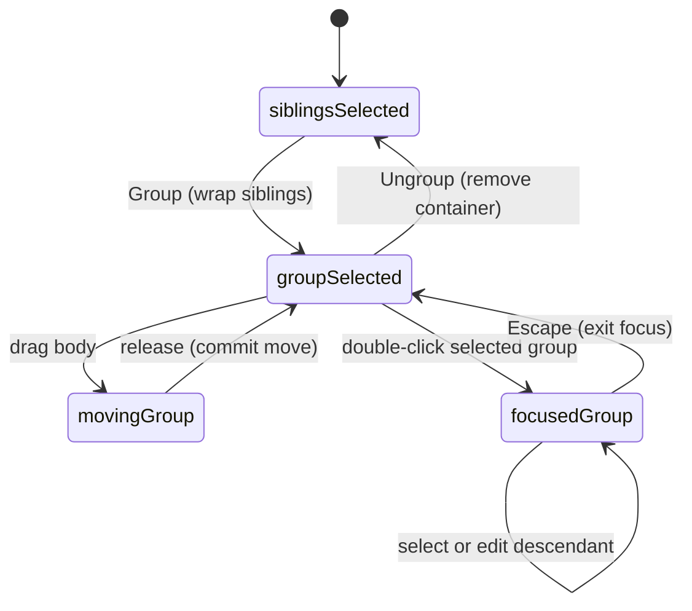

# Groups and focused editing

## Summary

Groups organize sibling layers and let them move, resize, or rotate as one
object. Select at least two sibling objects and press Cmd/Ctrl+G or use Group.
The new group becomes selected and appears as an expandable layer containing
the originals. Nested groups are supported.

Double-click a selected group to focus its descendants for individual selection.
Exit that focus with Escape to return to the outer group. Ungroup, reached with
Cmd/Ctrl+Shift+G, removes the container and selects its children.

## The simple case

Select two shapes in the same parent and press Cmd+G. A new Group layer contains
both shapes. Drag either visible shape with Pointer: the group moves as one
selection and the spacing between the shapes stays the same.

Double-click the selected grouped content, select a child, and edit it. Press
Escape to leave group focus and select the group again. Press Cmd+Shift+G to
remove the group while retaining its child artwork.

## The interaction, event by event

### Press

Group requires at least two distinct existing objects with the same parent.
Selecting objects from different parent levels does not produce a group that
silently reparents an unrelated subtree. Duplicate selection ids do not count
as multiple objects.

Group preserves the selected siblings' existing relative layer order. The new
container occupies the position of the first selected sibling in layer order;
other selected siblings are moved into that contiguous child block.

### Release without dragging

Grouping is immediate, with no placement drag or modal confirmation. A new
numbered group name is chosen and the container becomes the sole selection.
The original artwork remains editable children; grouping does not rasterize or
merge their fill and stroke geometry.

An ordinary click on visible grouped artwork selects its eligible group owner.
A double-click first selects the group if it is not already the sole selection;
when it is selected, the drill-in action focuses that group and selects the
clicked descendant. The two states explain why an initial double-click can
appear to select rather than enter deeply nested content.

### Begin dragging

A selected group's body drag uses the ordinary selection movement path. Its
children move together; the group has one outer selection frame, not a frame
for every leaf. Resize and rotate use the
[shared transform gestures](../selection/resizing-and-rotating.md).

Inside group focus, a descendant can become the drag target rather than the
outer group. Deeply nested descendants are reachable when hit testing identifies
them; focus is not restricted to one immediate-child selection level.

### While dragging

Moving the group preserves its children's arrangement. Resizing and rotating
transform that grouped arrangement through the shared container transform rules.
Bounds follow visible descendant artwork, so editing or hiding a child can
change the group's frame without creating a new group object.

Group focus limits the ordinary click ownership rule; it is not a second copy
of the artwork. Editing a descendant changes the same object shown inside the
expanded Layers row. Node can also focus a nearest group ancestor when it enters
a directly targeted path descendant.

### Release

A group drag commits through the shared movement/transform history behavior.
The group remains selected. Releasing a child drag leaves the focused child as
the edited selection; it does not automatically ungroup or exit focus.

Ungroup replaces the group's parent-level row with its immediate children in
their existing order. Those children become selected, and nested groups remain
nested objects rather than being recursively dissolved.

If the focused group is ungrouped, focus moves to its non-root parent or clears
at the workspace root. Deleting the last child also removes the now-empty group
as part of the same document change. There is no useful empty group placeholder
left behind to receive later drawing by accident.

## Modifiers

| Modifier | Set at the start | Changed while dragging |
| --- | --- | --- |
| Shift | Adds/toggles object selection; with Cmd/Ctrl+G selects Ungroup instead of Group. | Group body/handle drags follow the shared move/resize/rotate constraints. |
| Alt/Option | Cmd/Ctrl+Alt+G is excluded from the grouping shortcut; Alt drag can duplicate a selection. | Duplication timing follows moving; no group-specific alternate mode. |
| Ctrl/Cmd | Cmd/Ctrl+G groups eligible siblings; Cmd/Ctrl+Shift+G ungroups. | No group-specific live modifier; direct descendant tools own their variants. |
| Space | Temporary pan preserves ordinary group content and selects no new child by itself. | Pan takeover during a group/child drag needs the corresponding gesture check. |

## Cancel and interrupt

| Event | Before dragging | While dragging |
| --- | --- | --- |
| Escape | Exits focused group and selects it; otherwise Pointer clears ordinary selection. | Move/transform listener behavior owns the held gesture; exiting focus is not proven rollback. |
| Switching tools | Group hierarchy remains; Node can enter a descendant's editable path. | Existing move/transform teardown follows those gesture descriptions. |
| Menu opening or undo/redo | Menus expose group/ungroup; Undo restores the prior hierarchy. | Grouping/history commands during a held child drag need verification. |
| Window loses focus | Clears temporary modifiers; no command dissolves groups on blur. | Shared gesture release/cleanup needs verification. |
| Pointer leaves the window | No group-tree mutation occurs from hover exit. | Outside release follows the active body/handle listener, not group focus. |
| Reload or tab close | Document loading owns persisted groups; the current page focus session ends. | A gesture is not resumed automatically; interrupted document persistence needs checking. |
| Target changed or deleted | Commands reject absent/non-group targets; deleting the final child removes its group. | Deleting the selected/focused group during a child drag requires a browser check. |
| Touch cancel or second input device | Grouping commands have no held-device transaction themselves. | Shared move/resize/rotate pointercancel currently commits partial changes; touch drill-in needs physical verification. |

## Interactions with other systems

Containers and groups support nested descendants and preserve the original
parent when wrapping eligible siblings. Ungroup is one level at a time. A Frame
can be a parent, but group focus and production boundaries are different states.

Selection and locked/hidden objects: canvas hits use visible eligible artwork;
Layers exposes the hierarchy separately. Hidden children stop contributing to
visible bounds. Group selection colors aggregate distinct descendant fill and
stroke paints; changing one replaces matching paints across the selected group.
Lock restrictions on keyboard grouping should be tested independently of hits.

History includes group/ungroup and artwork transforms. Merely entering/exiting
focus is selection state, not a document undo step. Removing an empty group is
part of the child deletion, not a second manually requested cleanup action.

Zoom changes the screen frame without changing parent/child relationships.
Offline grouping and focused selection require no server request.
Touch and stylus double-tap/drill-in delivery is not proven by mouse tests.
Collaboration-driven changes to a focused hierarchy are not established.

## Edge cases

Grouping nonadjacent siblings makes their selected block contiguous. Their
relative order is preserved, but their relationship to intervening unselected
siblings can change because the container occupies one position in the tree.
The user should inspect overlapping artwork after grouping scattered layers.

Groups accept supported node types, including other groups; vector compounds
remain their own objects inside a group. Group does not choose a boolean
operation or combine child strokes into one silhouette.

Selecting artwork outside the focused group clears that focus through shared
selection rules. Ungrouping a nested focused group can focus its parent. These
are distinct from repeatedly pressing Escape, which selects the exited group.

## Open questions and verification

- Verify transformed-group ungrouping, hidden/locked descendant commands,
  nonadjacent sibling overlap, and group deletion during an active child drag.
- No independent group-specific defect is established from these source paths.
  Shared transform cancellation is tracked with selection behavior.
- Evidence: node-tree grouping/ungrouping, group selection queries, canvas
  drill-in, keyboard shortcuts, group geometry/property support, and
  group-selection/E2E tests. [Group checklist](../verification/vector.md#workspacegroupsmd).

Source reviewed against PunchPress commit `d4e6d4a`. Status: drafted.
