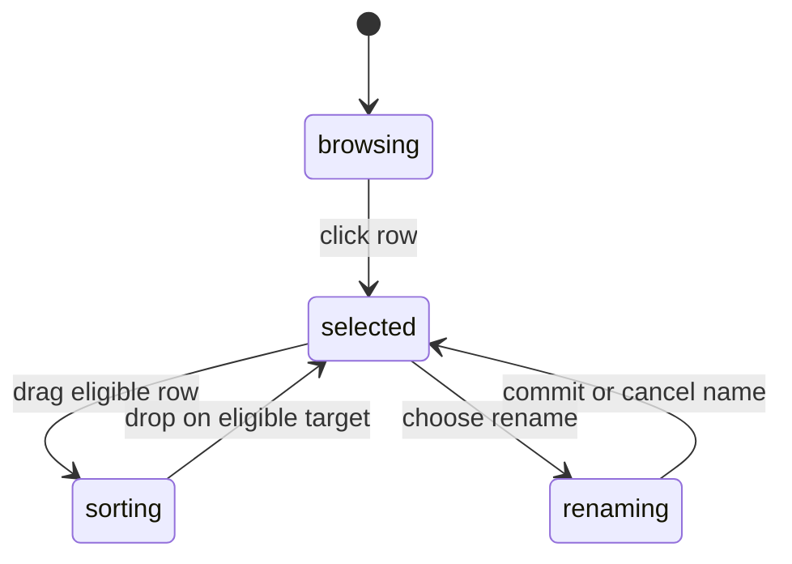

# The Layers panel

## Summary

Layers shows document objects in their hierarchy and display order. It is an
alternate selection surface, including objects that are difficult to click on
the canvas. Rows expose visibility and contextual object actions.

## The simple case

Click a row to select its artwork. Click its visibility button to hide or show
it. Expand a container to reach its children. Use New layer to create an empty
placeholder that a later content action can materialize.

## The interaction, event by event

### Press

A row selects its object in the appropriate parent focus. Shift toggles that
object's membership; it is not a range-selection operation in this handler.
Selecting a path while Node/path editing is active can enter that path directly.

### Release without dragging

The row remains selected. Visibility changes affect document content, while
expanding or collapsing a tree branch changes panel presentation. Double-click
on a selected sole container enters its focus; text can enter inline editing,
and eligible paths can enter Node editing.

### Begin dragging

Layer sorting is enabled while the pointer is in the layer list or sorting is
already active, and is disabled during canvas selection dragging. A rendered
range containing contour rows is not sortable through the normal node list.

### While dragging

The dragged row has a visual ghost. Reordering considers actual object ids and
parents. Dragging a parent onto its descendant is rejected. Ordinary cross-parent
reordering is rejected except for specific Frame/path routing.

### Release

Sibling drops change displayed order. Dropping a non-Frame on a Frame reparents
it there. Path layer moves have their own vector-aware route. Rejected drops
do not become arbitrary tree reparenting.

Renaming is a separate field lifecycle. Enter or blur commits the name; Escape
restores the row label and exits renaming. Confirm the exact naming eligibility
through the row's menu rather than assuming every leaf can be renamed there.

## Modifiers

| Modifier | Set at the start | Changed while dragging |
| --- | --- | --- |
| Shift | Toggle clicked row selection. | No range expansion is defined by the row handler; sorting modifier behavior needs verification. |
| Alt/Option | No alternate row selection mode. | No copy-on-drop mode defined in panel move routing. |
| Ctrl/Cmd | Ordinary document shortcuts respect focused inputs/menus. | No cross-parent override defined. |
| Space | A row is not a canvas pan surface. | Shared Space state can change; sort interaction needs verification. |

## Cancel and interrupt

| Event | Before dragging | While dragging |
| --- | --- | --- |
| Escape | Cancels name editing; otherwise context/focus determines dispatch. | Sortable-library cancellation needs browser verification. |
| Switching tools | Selection persists with tool-specific entry behavior. | Sorting completion during a tool change needs verification. |
| Menu opening or undo/redo | Row menu actions operate on their target. | Undo/drop overlap needs verification; menus block ordinary canvas shortcuts. |
| Window loses focus | Input blur commits an active rename. | Drag termination depends on sortable input handling. |
| Pointer leaves the window | No tree change from hover alone. | Outside release/drop result needs verification. |
| Reload or tab close | Panel-local collapse/rename state may be lost. | Only already-applied document changes can be persisted. |
| Target changed or deleted | Missing objects cannot be moved. | Drop routing checks current source/target existence and rejects missing ids. |
| Touch cancel or second input device | No hardware equivalence established. | Sorting cancellation/device takeover needs verification. |

## Interactions with other systems

Containers and groups determine row indentation and eligible moves. Selection
and hidden objects remain accessible through rows even when canvas hits differ.
History tracks document order/visibility/content actions, not list scroll.
Zoom does not scale the panel. Offline rows use local state. Touch and stylus
sorting are unverified. No collaboration reconciliation is promised.

## Edge cases

- Shift toggles one row, unlike file-manager Shift range selection.
- Dense containers can start collapsed; the list renders only a visible range.
- Contour rows expose path editing but are not independent reorderable objects.
- Dragging onto a Frame differs from dragging onto an ordinary sibling.

## Open questions and verification

- Check rejected drops, pointer cancellation, rename Escape versus blur, and
  keyboard access with a long virtualized list.
- Evidence: layers-panel move routing, layer-tree-row selection/rename handlers,
  layer-actions, vector-layer-move, empty-layer tests.

Source reviewed against PunchPress commit `d4e6d4a`. Status: drafted.
