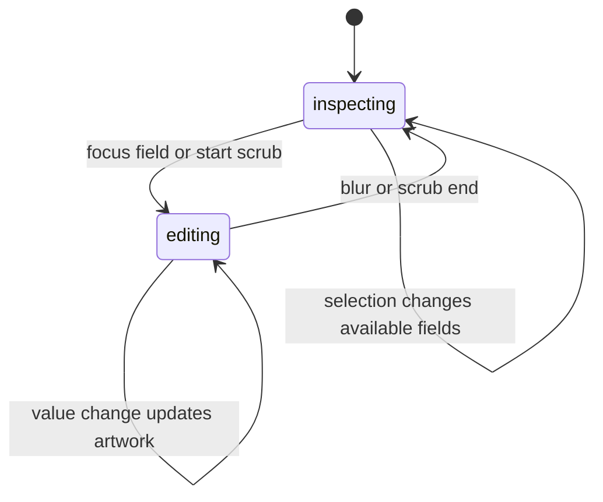

# The Properties panel

## Summary

Properties shows controls that apply to the current object or editing scope.
Multi-selection exposes common appearance and mixed values. Brush settings can
remain available with no object selected. An unsupported field is omitted.

## The simple case

Select a Frame to see Width, Height, and Color. Change a dimension and observe
the artwork update. Select text to get text controls, or enter path-point editing
to inspect the applicable point/corner controls.

## The interaction, event by event

### Press

Fields derive their target from the current selection and path-editing scope.
A vector child path can be the inspected object while its container is the
visible selection. Numeric text entry keeps a local draft while focused.

### Release without dragging

Focusing a field does not itself change the document. Clicking a discrete option
can apply immediately; there is no panel-wide Save button or draft transaction.

### Begin dragging

Controls that support scrubbing establish a history mark at scrub start. Plain
numeric text fields instead parse each edit as it arrives. Different field types
must not be described as one identical commit-on-blur interaction.

### While dragging

Scrubs update the selected property through editor commands. Mixed-value color
controls edit the selected paints represented by the chosen color, rather than
an arbitrary single node. Unsupported properties are hidden.

The simple numeric field accepts finite JavaScript numbers. Invalid text stays
as a draft without a value update. Empty text converts to zero; a minimum then
clamps it. Clearing Frame Width therefore applies its minimum of one before a
replacement value is typed. This is a suspected numeric-input UX problem.

### Release

Scrub end commits the grouped history mark. Unmounting a scrubbing field also
commits its mark. Numeric blur resets the displayed draft from the latest value,
rounded to an integer for this control. It does not undo earlier live updates.

## Modifiers

| Modifier | Set at the start | Changed while dragging |
| --- | --- | --- |
| Shift | Control-specific keyboard behavior; no panel-wide rule. | Scrub increments depend on the control; verify individually. |
| Alt/Option | No panel-wide alternate value mode. | No universal alternate scrub defined. |
| Ctrl/Cmd | Text-edit commands belong to the focused input. | Canvas history shortcuts are suppressed while focus is in the input. |
| Space | Normal input text rather than temporary pan in text fields. | Scrub/popup Space behavior needs verification. |

## Cancel and interrupt

| Event | Before dragging | While dragging |
| --- | --- | --- |
| Escape | A popup may close; no whole-panel transaction to cancel. | Plain numeric field has no Escape rollback handler; control-specific scrubs need verification. |
| Switching tools | Changes available settings. | Unmount commits a scrub mark; no general rollback. |
| Menu opening or undo/redo | Focus suppresses ordinary canvas shortcuts. | Already-applied edits persist; history routing after focus moves needs verification. |
| Window loses focus | Numeric blur resets display to current value. | Partial live edits remain; scrub ending needs verification. |
| Pointer leaves the window | No edit from hover alone. | Outside release for each scrub control needs verification. |
| Reload or tab close | Ends local field draft. | Applied document edits follow workspace persistence, not draft text. |
| Target changed or deleted | Panel changes to current eligible target. | Focused draft versus changed selection needs verification; unmount commits scrub mark. |
| Touch cancel or second input device | No universal control/device equivalence. | Scrub cancellation and touch inputs need verification. |

## Interactions with other systems

Containers and groups expose aggregate properties when supported. Selection and
hidden/locked targets require per-command eligibility checks. History grouping
depends on scrub versus ordinary entry. Zoom does not resize the controls.
Offline property changes use local state. Touch and stylus depend on control
input support. Collaboration during a focused draft is not established.

## Edge cases

- No selection normally hides the panel; raster tool settings and bootstrap
  errors can still make it visible.
- “Mixed” denotes different selected values, not a stored property value.
- Integer display can hide fractional stored values after blur.
- Clearing an input can already alter artwork before the next character.

## Open questions and verification

- Verify numeric clearing, invalid text, fractional display, and undo granularity.
- Evidence: properties panel/state, NumberField, Frame fields, property scrub
  history, selection-properties and path-inspector tests.

Source reviewed against PunchPress commit `d4e6d4a`. Status: drafted.
